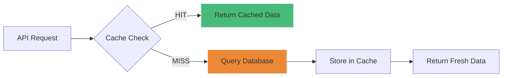
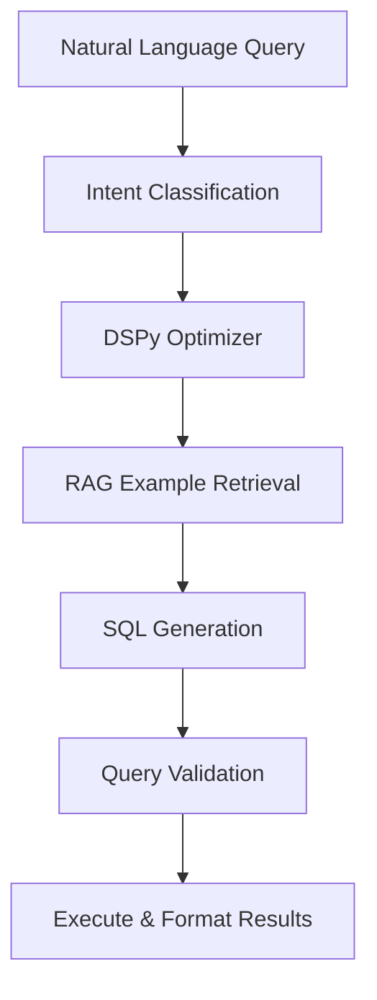
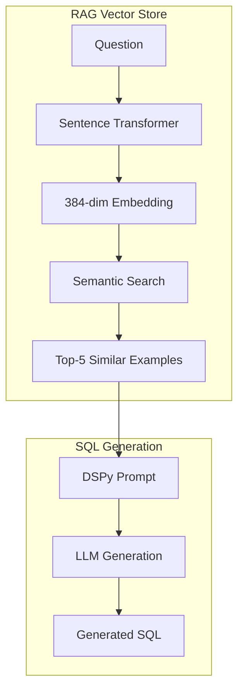
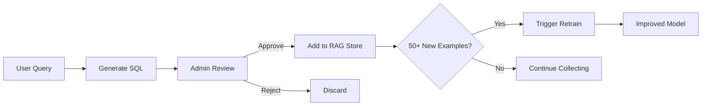
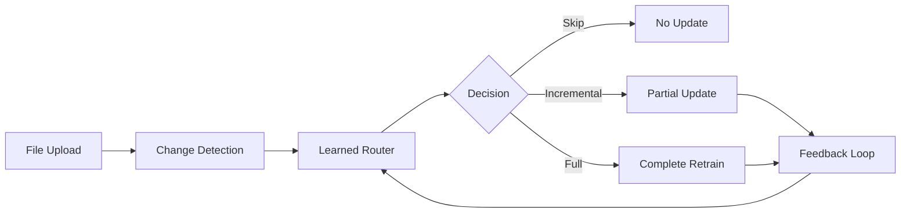
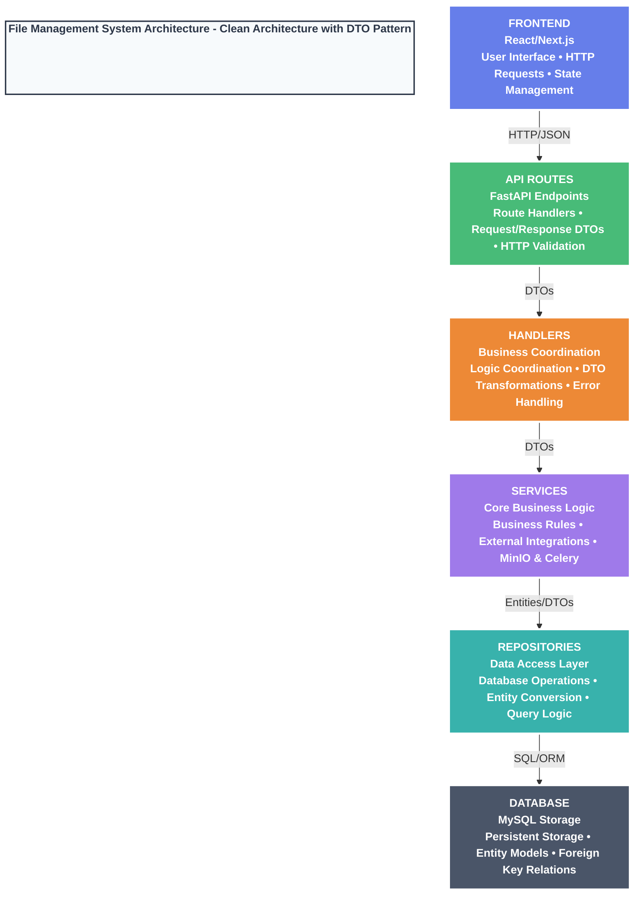
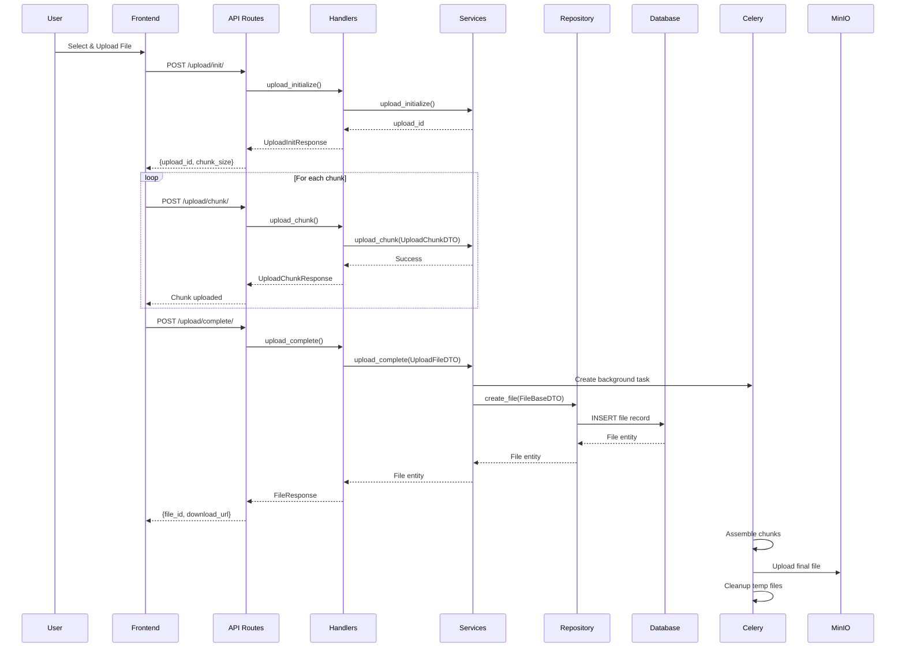
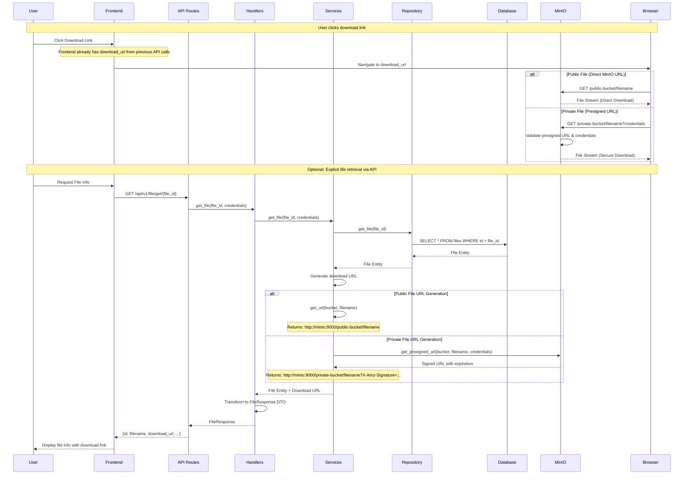

# File Management Service

[](https://codecov.io/github/hanieas/fastapi-file-management-service)

## Table of Contents
1. [Introduction](#introduction)
2. [Technology Stack and Features](#technology-stack-and-features)
3. [Why a Separate File Management Service?](#why-a-separate-file-management-service)
4. [How to Use it?](#how-to-use-it)
5. [API Endpoints](#api-endpoints)
6. [🚀 Redis Caching Layer](#-redis-caching-layer)
7. [🧠 AI-Powered SQL Chatbot](#-ai-powered-sql-chatbot)
8. [🔄 RAG & Auto-Learn System](#-rag--auto-learn-system)
9. [🆕 Incremental ML Pipeline](#-incremental-ml-pipeline)
10. [🔐 Keycloak Enterprise IAM](#-keycloak-enterprise-iam)
11. [Contributing](#Contributing)
12. [Local HTTPS Trust (Caddy Internal CA)](#local-https-trust-caddy-internal-ca)

## Introduction

This microservice is designed to manage all file-related tasks. It uses **MinIO** for object storage and **MySQL** for managing file metadata. We support chunk uploads for handling large files efficiently, with **Celery** running background tasks to ensure smooth performance.

## Technology Stack and Features

- ⚡ [**FastAPI**](https://fastapi.tiangolo.com) for the Python backend API.
- 🧰 [SQLAlchemy](https://www.sqlalchemy.org/) for the Python SQL database interactions (ORM).
- 🔍 [Pydantic](https://docs.pydantic.dev), used by FastAPI, for the data validation and settings management.
- 🗄️ [MYSQL](https://www.mysql.com/) as the SQL database.
- 🔄 [Alembic](https://alembic.sqlalchemy.org/en/latest) for database migrations.
- 🔧 [Celery](https://docs.celeryq.dev/en/stable/) with [RabbitMQ](https://www.rabbitmq.com/) for task queue management and background processing.
- 💾 [MinIO](https://min.io/) for scalable object storage with chunk upload support.
- ✅ [Pytest](https://pytest.org) for testing to ensure code reliability and functionality.
- 🐋 [Docker Compose](https://www.docker.com) for development and production.
- 🤖 [**Scikit-learn**](https://scikit-learn.org/) for ML-powered incremental model updates (inspired by IVM research).
- 🧠 **Learned Router** - ML model that predicts optimal update strategies based on data delta characteristics.
- 🔐 [**Keycloak**](https://www.keycloak.org/) for enterprise IAM with SSO, MFA, social login, and LDAP support.
- 🗄️ **Redis 7** for high-performance caching layer with 85%+ hit rate.
- 🤖 **DSPy + RAG** for intelligent Text-to-SQL with semantic example retrieval.
- 🔄 **Auto-Learn Feedback Loop** for continuous model improvement from admin feedback.
  
## Why a Separate File Management Service?

1. Centralizes file operations, making management and maintenance easier.
2. Enables scaling file handling independently of other services.
3. Simplifies updates and changes to file handling without impacting other parts of the system.
4. Reduces code duplication by keeping file upload and retrieval logic in one place, resulting in cleaner code.

## How to Use it?

1. **Complete the `.env` File**: 
    - Copy the contents of `.env.example` to a new file named `.env`.
    - Fill in the required environment variables based on your setup.

2. **Build the Docker Image**:
    - Run the following command to build the Docker image:
        ```bash
        docker compose build
        ```

3. **Run the Containers**:
    - After the build is complete, start the containers in detached mode with:
        ```bash
        docker compose up -d
        ```

4. **Migrate the Database**:
    - Access the running container to perform the database migration:
        ```bash
        docker compose exec filemanager bash
        ```
    - Inside the container, run the migration using Alembic:
        ```bash
        alembic upgrade head
        ```

5. **Access the Service**:
    - Use the site via the Caddy proxy at `https://localhost:9443` (recommended for local dev; HTTPS with Caddy's internal CA).
    - API is reachable at `https://localhost:9443/api/...` (proxied to FastAPI on `filemanager:8000`).
    - Next.js dev server runs on `http://localhost:3000`, but access it through the proxy at `https://localhost:9443` so the app and API share the same HTTPS origin.
    - Swagger docs: `https://localhost:9443/api/docs`.

## Local HTTPS Trust (Caddy Internal CA)

If you are accessing the API via `https://localhost:9443` through Caddy, trust Caddy's local root CA once on your machine (Windows example, run from the project folder):

```cmd
curl -k https://localhost:9443/minio/health/ready
docker compose cp caddy:/data/caddy/pki/authorities/local/root.crt .\caddy-local-root.crt
```
Run this third one in an elevated cmd prompt:
```cmd
certutil -addstore -f "Root" "%CD%\caddy-local-root.crt"
```

Notes:
- First command triggers certificate generation inside the Caddy container.
- Second copies the CA root cert to your current directory.
- Third adds it to the Windows Trusted Root store so the browser trusts `https://localhost:9443`.

## Access and Ports (Dev vs Production)

- **Web UI (dev)**: `https://localhost:9443` via Caddy. Caddy proxies the Next.js dev server on `localhost:3000` and the API on `filemanager:8000`.
- **MinIO Console (dev)**: `https://localhost:9443/console` (proxied to `minio:9090`).
- **Direct service ports (exposed for local development only)**:
  - FastAPI API: `8000`
  - Next.js dev: `3000` (host machine)
  - MinIO API: `9001` (maps to container `9000`)
  - MinIO Console: `9090`
  - MySQL: `3307` (maps to container `3306`)
  - RabbitMQ: `5672` (broker), `15672` (management UI)
  - ClamAV daemon: `3310`
  - ClamAV REST (Node): `9002` (maps to container `3000`)

In **production**, these backend service ports should not be exposed directly. Place services behind a reverse proxy/load balancer (e.g., Caddy/Ingress) and expose only the proxy (typically `443/80`).

## API Endpoints

Here’s a quick reference guide to the available API endpoints, their methods, and what they do:

| Method | URL                                         | Description                                                      |
|--------|---------------------------------------------|------------------------------------------------------------------|
| POST   | `/api/v1/file/upload/init/`                 | Initialize a new file upload session.                            |
| POST   | `/api/v1/file/upload/chunk/`                | Upload a file chunk.                                             |
| POST   | `/api/v1/file/upload/complete/`             | Complete the file upload process.                                |
| GET    | `/api/v1/file/get/{file_id}`                | Retrieve a file by its ID.                                       |
| GET    | `/api/v1/file/status/{file_id}`             | Check the upload status of a file.                               |
| POST   | `/api/v1/file/upload/retry`                 | Retry uploading a file.                                          |

A Postman collection export is also available for testing these endpoints. You can import it into Postman to quickly get started with API testing.

## 🚀 Redis Caching Layer

> **Performance Feature**: Enterprise-grade Redis caching for sub-millisecond response times and 85%+ cache hit rates.

The platform includes a high-performance Redis caching layer that dramatically improves API response times by caching frequently accessed data.

### Architecture


```mermaid
graph LR
    A[API Request] --> B{Cache Check}
    B -->|HIT| C[Return Cached Data]
    B -->|MISS| D[Query Database]
    D --> E[Store in Cache]
    E --> F[Return Fresh Data]
    
    style C fill:#48BB78,stroke:#fff
    style D fill:#ED8936,stroke:#fff
```

### Features

| Feature | Description |
|---------|-------------|
| **Multi-Service Caching** | Users, Organizations, Folders, Files, Appointments |
| **85%+ Hit Rate** | Most requests served from cache |
| **LRU Eviction** | Intelligent memory management with 256MB limit |
| **TTL Management** | Automatic cache expiration (5 minutes default) |
| **Cache Invalidation** | Automatic invalidation on data updates |

### Cached Services

| Service | Cache Key Pattern | TTL |
|---------|------------------|-----|
| User Service | `user:{id}`, `user:email:{email}` | 300s |
| Organization Service | `org:{id}`, `org:slug:{slug}` | 300s |
| Folder Service | `folder:{id}`, `folders:user:{user_id}` | 300s |
| File Service | `file:{id}`, `files:folder:{folder_id}` | 300s |
| Appointment Service | `appointment:{id}` | 300s |

### Configuration

```yaml
# docker-compose.yml
redis:
  image: redis:7-alpine
  command: redis-server --maxmemory 256mb --maxmemory-policy allkeys-lru
  ports:
    - "6379:6379"
```

### Performance Metrics

```bash
# Check cache statistics
curl https://localhost:9443/api/v1/health/cache-stats
```

**Expected Results:**
- Cache Hit Rate: ~85%
- Average Response Time: <50ms (cached) vs ~200ms (uncached)
- Memory Usage: <256MB

---

## 🧠 AI-Powered SQL Chatbot

> **Enterprise Feature**: Natural language to SQL conversion with semantic understanding.

The platform includes an intelligent chatbot that converts natural language questions into SQL queries, allowing users to query their data without writing SQL.

### Architecture


```mermaid
graph TB
    A[Natural Language Query] --> B[Intent Classification]
    B --> C[DSPy Optimizer]
    C --> D[RAG Example Retrieval]
    D --> E[SQL Generation]
    E --> F[Query Validation]
    F --> G[Execute & Format Results]
```

### Features

| Feature | Description |
|---------|-------------|
| **Text-to-SQL** | Convert "How many users registered today?" to SQL |
| **DSPy Optimization** | Self-improving prompt optimization |
| **RAG Integration** | Semantic retrieval of relevant examples |
| **Multi-LLM Support** | OpenAI, Ollama, or NVIDIA endpoints |
| **Safety Validation** | Prevents SQL injection and unauthorized queries |

### API Endpoints

| Method | URL | Description |
|--------|-----|-------------|
| POST | `/api/v1/chat/sql` | Convert natural language to SQL |
| POST | `/api/v1/chat/sql/execute` | Execute generated SQL query |
| GET | `/api/v1/chat/sql/examples` | Get example queries |
| GET | `/api/v1/chat/health` | Chatbot health status |

### Example Usage

```bash
# Ask a natural language question
curl -X POST https://localhost:9443/api/v1/chat/sql \
  -H "Authorization: Bearer <token>" \
  -H "Content-Type: application/json" \
  -d '{"question": "How many files were uploaded this week?"}'

# Response
{
  "sql": "SELECT COUNT(*) as file_count FROM files WHERE created_at >= DATE_SUB(NOW(), INTERVAL 7 DAY)",
  "confidence": 0.94,
  "examples_used": 3
}
```

---

## 🔄 RAG & Auto-Learn System

> **Enterprise Feature**: Retrieval-Augmented Generation with continuous learning from feedback.

The platform implements a sophisticated RAG (Retrieval-Augmented Generation) system that improves SQL generation accuracy over time by learning from admin-approved feedback.

### RAG Architecture


```mermaid
graph TB
    subgraph "RAG Vector Store"
        A[Question] --> B[Sentence Transformer]
        B --> C[384-dim Embedding]
        C --> D[Semantic Search]
        D --> E[Top-5 Similar Examples]
    end
    
    subgraph "SQL Generation"
        E --> F[DSPy Prompt]
        F --> G[LLM Generation]
        G --> H[Generated SQL]
    end
```

### Features

| Feature | Description |
|---------|-------------|
| **Semantic Search** | Find relevant examples based on meaning, not keywords |
| **144+ Base Examples** | Pre-trained on common file management queries |
| **Dynamic Retrieval** | Top-5 most relevant examples injected into prompts |
| **Thread-Safe** | Concurrent access with proper locking |
| **Persistent Storage** | Examples survive container restarts |

### Auto-Learn Feedback Loop


```mermaid
graph LR
    A[User Query] --> B[Generate SQL]
    B --> C[Admin Review]
    C -->|Approve| D[Add to RAG Store]
    C -->|Reject| E[Discard]
    D --> F{50+ New Examples?}
    F -->|Yes| G[Trigger Retrain]
    F -->|No| H[Continue Collecting]
    G --> I[Improved Model]
```

### API Endpoints

| Method | URL | Description |
|--------|-----|-------------|
| POST | `/api/v1/chat/sql/feedback` | Submit SQL feedback |
| POST | `/api/v1/chat/sql/feedback/approve` | Admin approves feedback |
| GET | `/api/v1/chat/sql/feedback/pending` | List pending feedback |
| GET | `/api/v1/chat/auto-learn/stats` | Auto-learn statistics |
| POST | `/api/v1/chat/auto-learn/force-retrain` | Force model retrain |
| GET | `/api/v1/chat/rag/search` | Search RAG examples |

### Example Workflow

```bash
# 1. User submits feedback
curl -X POST https://localhost:9443/api/v1/chat/sql/feedback \
  -H "Authorization: Bearer <token>" \
  -d '{
    "question": "Show me all PDFs uploaded last month",
    "generated_sql": "SELECT * FROM files WHERE content_type LIKE '%pdf%'",
    "corrected_sql": "SELECT * FROM files WHERE content_type = 'application/pdf' AND created_at >= DATE_SUB(NOW(), INTERVAL 1 MONTH)"
  }'

# 2. Admin approves feedback
curl -X POST https://localhost:9443/api/v1/chat/sql/feedback/approve \
  -H "Authorization: Bearer <admin_token>" \
  -d '{"feedback_id": "abc123"}'

# 3. Check auto-learn stats
curl https://localhost:9443/api/v1/chat/auto-learn/stats
# Returns: {"total_examples": 145, "feedback_examples": 1, "retrain_threshold": 50}

# 4. Search RAG examples
curl "https://localhost:9443/api/v1/chat/rag/search?query=how%20many%20users"
# Returns top-5 similar examples with similarity scores
```

### Configuration

| Environment Variable | Default | Description |
|---------------------|---------|-------------|
| `RAG_EMBEDDING_MODEL` | `all-MiniLM-L6-v2` | Sentence transformer model |
| `RAG_TOP_K` | `5` | Number of examples to retrieve |
| `AUTO_LEARN_THRESHOLD` | `50` | Feedback count to trigger retrain |
| `AUTO_LEARN_COOLDOWN` | `86400` | Seconds between retrains (24h) |

📖 **Full Documentation**: See [`documentation/CHATBOT_ARCHITECTURE.md`](documentation/CHATBOT_ARCHITECTURE.md) for comprehensive technical details.

## 🆕 Incremental ML Pipeline

> **Research Feature**: Applying database Incremental View Maintenance (IVM) concepts to ML model updates - inspired by DaST research at UZH.

This feature implements an intelligent ML pipeline that automatically decides the optimal strategy for updating ML models when data changes, rather than always performing expensive full retraining.

### Key Concepts

| Concept | Description |
|---------|-------------|
| **Incremental View Maintenance (IVM)** | Database technique for efficiently updating materialized views when base data changes |
| **Learned Router** | ML model that predicts the optimal update strategy based on delta characteristics |
| **Cost Optimizer** | Estimates computational cost of different update strategies |
| **Feedback Loop** | Continuously improves routing decisions based on actual outcomes |

### Architecture


```mermaid
graph LR
    A[File Upload] --> B[Change Detection]
    B --> C[Learned Router]
    C --> D{Decision}
    D -->|Skip| E[No Update]
    D -->|Incremental| F[Partial Update]
    D -->|Full| G[Complete Retrain]
    F --> H[Feedback Loop]
    G --> H
    H --> C
```

### Quick Start

```bash
# 1. Train the learned router with synthetic data
curl -X POST "https://localhost:9443/api/v1/pipeline/router/train-synthetic?n_samples=500"

# 2. Calibrate cost optimizer with real measurements
curl -X POST "https://localhost:9443/api/v1/pipeline/cost/calibrate"

# 3. Check system health
curl "https://localhost:9443/api/v1/pipeline/health"

# 4. Upload a CSV file - pipeline auto-triggers!
```

### New Endpoints

| Method | URL | Description |
|--------|-----|-------------|
| POST | `/api/v1/pipeline/router/train-synthetic` | Train router with synthetic data |
| GET | `/api/v1/pipeline/router/status` | Get router status and feature importance |
| POST | `/api/v1/pipeline/cost/calibrate` | Calibrate cost model with benchmarks |
| GET | `/api/v1/pipeline/cost/stats` | Get calibration statistics |
| GET | `/api/v1/pipeline/feedback/stats` | Get feedback loop statistics |
| GET | `/api/v1/pipeline/feedback/recommendations` | Get system recommendations |
| POST | `/api/v1/pipeline/run/{file_id}` | Manually run pipeline for a file |
| GET | `/api/v1/pipeline/model/status` | Get ML model training status |
| GET | `/api/v1/pipeline/health` | System health check |

### Research Relevance

This implementation demonstrates practical application of concepts from:
- **Incremental View Maintenance (IVM)**: Instead of recomputing entire ML models, we maintain them incrementally
- **Adaptive Query Processing**: The learned router adapts its decisions based on data characteristics
- **Cost-Based Optimization**: Using cost models to select optimal update strategies

📖 **Full Documentation**: See [`documentation/INCREMENTAL_ML_PIPELINE.md`](documentation/INCREMENTAL_ML_PIPELINE.md) for comprehensive technical details.

## 🔐 Keycloak Enterprise IAM

This service includes enterprise-grade Identity and Access Management (IAM) powered by [Keycloak](https://www.keycloak.org/).

### Features

| Feature | Description |
|---------|-------------|
| **Single Sign-On (SSO)** | Login once, access multiple applications |
| **Social Login** | Google, GitHub, Microsoft authentication |
| **Multi-Factor Authentication** | TOTP, WebAuthn security options |
| **LDAP/Active Directory** | Enterprise directory integration |
| **Fine-grained RBAC** | Role-based access control with permissions |
| **OAuth2/OIDC** | Industry-standard authentication protocols |
| **Admin Console** | Web-based user management interface |

### Quick Start

```bash
# Start all services including Keycloak
docker-compose up -d

# Access Keycloak Admin Console
# URL: http://localhost:8080
# Username: admin
# Password: admin
```

### Authentication Endpoints

| Method | URL | Description |
|--------|-----|-------------|
| POST | `/api/v1/auth/keycloak/login` | Direct login with email/password |
| GET | `/api/v1/auth/keycloak/login/oauth2/authorize` | Start OAuth2 flow |
| GET | `/api/v1/auth/keycloak/social/{provider}` | Social login (google, github, microsoft) |
| POST | `/api/v1/auth/keycloak/refresh` | Refresh access token |
| POST | `/api/v1/auth/keycloak/logout` | Logout and invalidate session |
| GET | `/api/v1/auth/keycloak/me` | Get current user profile |

### Admin Endpoints

| Method | URL | Description |
|--------|-----|-------------|
| GET | `/api/v1/admin/keycloak/users` | List all users |
| POST | `/api/v1/admin/keycloak/users` | Create user |
| PUT | `/api/v1/admin/keycloak/users/{id}` | Update user |
| POST | `/api/v1/admin/keycloak/users/{id}/roles` | Assign roles |
| POST | `/api/v1/admin/keycloak/users/{id}/mfa/enable` | Enable MFA |
| GET | `/api/v1/admin/keycloak/stats` | System statistics |

### Predefined Roles

| Role | Access Level |
|------|--------------|
| `super_admin` | Full system access |
| `org_admin` | Organization management |
| `manager` | Team resource management |
| `user` | Standard file operations |
| `viewer` | Read-only access |

📖 **Full Documentation**: See [`documentation/KEYCLOAK_INTEGRATION.md`](documentation/KEYCLOAK_INTEGRATION.md) for comprehensive setup and configuration guide.

## Contributing

We welcome contributions from everyone! If you have ideas for improvements, new features, or bug fixes, feel free to contribute to this project. Here's how you can get involved:

1. **Create an Issue**: 
    - If you find a bug, have a question, or want to suggest a feature, please open an issue. This helps us track and discuss your ideas.

2. **Send a Pull Request (PR)**:
    - Fork the repository, make your changes in a new branch, and then create a pull request. 
    - Please make sure your code follows the project's coding standards and passes all tests.

We appreciate your contributions and will do our best to review and merge your pull requests promptly. Thank you for helping us improve this project!

Frontend:

## Frontend
This is a [Next.js](https://nextjs.org) project bootstrapped with [`create-next-app`](https://nextjs.org/docs/app/api-reference/cli/create-next-app).


After running the Docker Containers, simply start the frontend using the following command. We have implemented CORS for backend integration.

```bash
npm run dev
# or
yarn dev
# or
pnpm dev
# or
bun dev
```

Open [http://localhost:3000](http://localhost:3000) with your browser to see the result.

# File Management System Architecture

## Clean Architecture with DTO Pattern


```mermaid
graph TD
    A["FRONTEND<br/>React/Next.js<br/>User Interface • HTTP Requests • State Management"] --> |"HTTP/JSON"| B["API ROUTES<br/>FastAPI Endpoints<br/>Route Handlers • Request/Response DTOs • HTTP Validation"]
    B --> |"DTOs"| C["HANDLERS<br/>Business Coordination<br/>Logic Coordination • DTO Transformations • Error Handling"]
    C --> |"DTOs"| D["SERVICES<br/>Core Business Logic<br/>Business Rules • External Integrations • MinIO & Celery"]
    D --> |"Entities/DTOs"| E["REPOSITORIES<br/>Data Access Layer<br/>Database Operations • Entity Conversion • Query Logic"]
    E --> |"SQL/ORM"| F["DATABASE<br/>MySQL Storage<br/>Persistent Storage • Entity Models • Foreign Key Relations"]

    %% Styling for each layer
    classDef frontend fill:#667EEA,stroke:#fff,stroke-width:3px,color:#fff,font-weight:bold
    classDef api fill:#48BB78,stroke:#fff,stroke-width:3px,color:#fff,font-weight:bold
    classDef handlers fill:#ED8936,stroke:#fff,stroke-width:3px,color:#fff,font-weight:bold
    classDef services fill:#9F7AEA,stroke:#fff,stroke-width:3px,color:#fff,font-weight:bold
    classDef repositories fill:#38B2AC,stroke:#fff,stroke-width:3px,color:#fff,font-weight:bold
    classDef database fill:#4A5568,stroke:#fff,stroke-width:3px,color:#fff,font-weight:bold

    %% Apply styles to nodes
    class A frontend
    class B api
    class C handlers
    class D services
    class E repositories
    class F database

    %% Add title and subtitle as subgraph
    subgraph Title ["File Management System Architecture - Clean Architecture with DTO Pattern"]
        direction TB
        G[" "]
    end
    
    %% Style the title subgraph
    classDef titleStyle fill:#F7FAFC,stroke:#2D3748,stroke-width:2px,color:#2D3748,font-weight:bold
    class Title titleStyle
    
    %% Hide the placeholder node
    classDef hidden fill:transparent,stroke:transparent,color:transparent
    class G hidden
```

## Key Architecture Principles

- **DTOs**: Data validation & transformation between layers
- **Clean separation of concerns**: Each layer has specific responsibilities  
- **Security through controlled data flow**: Input validation and controlled exposure
- **Scalable layered architecture**: Easy to maintain and extend

## Layer Responsibilities

### Frontend (React/Next.js)
- User interface components
- HTTP request handling
- Client-side state management

### API Routes (FastAPI)
- HTTP endpoint definitions
- Request/Response DTOs
- Input validation and serialization

### Handlers
- Business logic coordination
- DTO transformations between layers
- Error handling and response formatting

### Services
- Core business logic implementation
- External service integrations (MinIO, Celery)
- Business rule enforcement

### Repositories
- Database operations and queries
- Entity to DTO conversion
- Data access abstraction

### Database (MySQL)
- Persistent data storage
- Entity models with SQLAlchemy
- Foreign key relationships and constraints

---

# 📄 File Upload Process - Detailed Flow

## 🎯 Overview
The file management system uses a **chunked upload strategy** with background processing to handle large files efficiently. Here's the complete flow through all architectural layers:

## 📊 Complete Upload Flow Diagram


```mermaid
sequenceDiagram
    participant U as User
    participant F as Frontend
    participant A as API Routes
    participant H as Handlers
    participant S as Services
    participant R as Repository
    participant D as Database
    participant C as Celery
    participant M as MinIO

    U->>F: Select & Upload File
    F->>A: POST /upload/init/
    A->>H: upload_initialize()
    H->>S: upload_initialize()
    S-->>H: upload_id
    H-->>A: UploadInitResponse
    A-->>F: {upload_id, chunk_size}
    
    loop For each chunk
        F->>A: POST /upload/chunk/
        A->>H: upload_chunk()
        H->>S: upload_chunk(UploadChunkDTO)
        S-->>H: Success
        H-->>A: UploadChunkResponse
        A-->>F: Chunk uploaded
    end
    
    F->>A: POST /upload/complete/
    A->>H: upload_complete()
    H->>S: upload_complete(UploadFileDTO)
    S->>C: Create background task
    S->>R: create_file(FileBaseDTO)
    R->>D: INSERT file record
    D-->>R: File entity
    R-->>S: File entity
    S-->>H: File entity
    H-->>A: FileResponse
    A-->>F: {file_id, download_url}
    
    C->>C: Assemble chunks
    C->>M: Upload final file
    C->>C: Cleanup temp files
```

## 🌐 Layer-by-Layer Breakdown

### 1. **Frontend Layer (React/Next.js)**
**Three-Phase Upload Process:**

#### Phase 1: Upload Initialization
```typescript
// POST /api/v1/file/upload/init/
const initResponse = await fetch(`${API_BASE_URL}/upload/init/`, { method: 'POST' });
const { chunk_size, upload_id } = initResponse.data;
```
- **Purpose**: Get upload configuration and unique upload ID
- **Data Received**: `chunk_size`, `upload_id`

#### Phase 2: Chunked Upload
```typescript
const totalChunks = Math.ceil(file.size / chunk_size);
for (let i = 0; i < totalChunks; i++) {
  const chunk = file.slice(start, end);
  // POST /api/v1/file/upload/chunk/ for each chunk
}
```
- **Purpose**: Upload file in small chunks for large file handling
- **Progress Tracking**: Updates progress bar after each chunk

#### Phase 3: Upload Completion
```typescript
// POST /api/v1/file/upload/complete/
// Sends: upload metadata, appointment/user associations, file details
// Receives: File record with download URL
```

### 2. **API Routes Layer (FastAPI)**
**Route Definitions & Validation:**
- **`/upload/init/`**: Initialize upload session
- **`/upload/chunk/`**: Validate and receive chunks (size ≤ max chunk size)
- **`/upload/complete/`**: Finalize upload with comprehensive validation

### 3. **Handlers Layer (Business Coordination)**
**DTO Transformations:**
- **Input**: Form data → `UploadChunkDTO`, `UploadFileDTO`
- **Output**: `File` entity → `FileResponse`
- **Error Handling**: Service exceptions → HTTP status codes

### 4. **Services Layer (Core Business Logic)**
**Key Operations:**
- **Upload Initialize**: Create UUID, temporary directory
- **Upload Chunk**: Async file I/O, chunk validation
- **Upload Complete**: 
  - ✅ **Idempotency check** (prevents duplicates)
  - 🔒 **Security**: Public vs private bucket determination
  - ⚡ **Background Processing**: Celery task creation

### 5. **Repository Layer (Data Access)**
**Database Operations:**
- **DTO → Entity Conversion**: `FileBaseDTO` → `File` entity
- **Relationships**: Links to `appointments` and `users` tables
- **Transaction Management**: Commit/rollback handling

### 6. **Database Layer (MySQL Storage)**
**File Entity Structure:**
- 🟡 **Primary Key**: `id` (UUID)
- 🟢 **Unique Index**: `upload_id` (prevents duplicates)
- 🔴 **Foreign Keys**: `appointment_id`, `user_id`
- **JSON Columns**: `credential`, `detail` (flexible metadata)

### 7. **Background Processing (Celery Task)**
**Asynchronous File Assembly:**
1. **Assembly**: Combine all chunks in sequential order
2. **Storage**: Upload complete file to MinIO object storage
3. **Cleanup**: Remove temporary files and directories

## 🔑 Key Benefits

- **🔄 Idempotency**: `upload_id` prevents duplicate uploads
- **📦 Chunked Upload**: Handles large files and network interruptions
- **⚡ Async Processing**: Non-blocking API with background tasks
- **🔒 Security**: Public/private bucket determination
- **🎯 Clean Separation**: Each layer has specific responsibilities
- **📊 Comprehensive Logging**: Full traceability across layers
- **🛡️ Error Handling**: Graceful failure handling at each layer

This architecture ensures reliable, scalable, and maintainable file upload processing!

---

# 📥 File Download Process - Detailed Flow

## 🎯 Overview
The file download system provides **secure, efficient access** to stored files with support for both **public** and **private** files. The system generates download URLs dynamically and handles access control through credentials.

## 📊 Complete Download Flow Diagram


```mermaid
sequenceDiagram
    participant U as User
    participant F as Frontend
    participant A as API Routes
    participant H as Handlers
    participant S as Services
    participant R as Repository
    participant D as Database
    participant M as MinIO
    participant B as Browser

    Note over U,B: User clicks download link
    U->>F: Click Download Link
    Note over F: Frontend already has download_url from previous API calls
    F->>B: Navigate to download_url
    
    alt Public File (Direct MinIO URL)
        B->>M: GET /public-bucket/filename
        M-->>B: File Stream (Direct Download)
    else Private File (Presigned URL)
        B->>M: GET /private-bucket/filename?credentials
        M->>M: Validate presigned URL & credentials
        M-->>B: File Stream (Secure Download)
    end
    
    Note over U,B: Optional: Explicit file retrieval via API
    U->>F: Request File Info
    F->>A: GET /api/v1/file/get/{file_id}
    A->>H: get_file(file_id, credentials)
    H->>S: get_file(file_id, credentials)
    S->>R: get_file(file_id)
    R->>D: SELECT * FROM files WHERE id = file_id
    D-->>R: File Entity
    R-->>S: File Entity
    S->>S: Generate download URL
    
    alt Public File URL Generation
        S->>S: get_url(bucket, filename)
        Note over S: Returns: http://minio:9000/public-bucket/filename
    else Private File URL Generation
        S->>M: get_presigned_url(bucket, filename, credentials)
        M-->>S: Signed URL with expiration
        Note over S: Returns: http://minio:9000/private-bucket/filename?X-Amz-Signature=...
    end
    
    S-->>H: File Entity + Download URL
    H->>H: Transform to FileResponse DTO
    H-->>A: FileResponse
    A-->>F: {id, filename, download_url, ...}
    F-->>U: Display file info with download link
```

## 🌐 Layer-by-Layer Breakdown

### 1. **Frontend Layer (React/Next.js)**
**Download Link Interaction:**

#### Direct Download (Most Common)
```typescript
// Download links are already available in FileData
<a href={file.download_url} target="_blank" rel="noopener noreferrer">
  Download
</a>
```
- **Purpose**: Direct browser navigation to download URL
- **Behavior**: Opens in new tab, triggers browser download
- **URL Types**: 
  - Public: `http://minio:9000/public-bucket/filename`
  - Private: `http://minio:9000/private-bucket/filename?X-Amz-Signature=...`

#### Explicit File Retrieval (Optional)
```typescript
// GET /api/v1/file/get/{file_id}
const response = await fetch(`${API_BASE_URL}/get/${file_id}`);
const fileData = await response.json();
// Use fileData.download_url for download
```
- **Purpose**: Get fresh download URL and file metadata
- **Use Case**: When download URL has expired or file info is needed

### 2. **API Routes Layer (FastAPI)**
**File Retrieval Endpoint:**

```python
@router.get('/get/{file_id}', response_model=SuccessResponse[FileResponse])
async def endpoint(file_id: str, request: Request, file_handler: FileHandler = Depends(get_file_handler)):
    credential = dict(request.query_params)  # Extract credentials from query params
    return await file_handler.get_file(file_id=file_id, credential=credential)
```
- **Purpose**: Retrieve file metadata and generate fresh download URL
- **Validation**: File ID format, credential parsing
- **Security**: Credentials passed via query parameters

### 3. **Handlers Layer (Business Coordination)**
**File Retrieval Handler:**

```python
async def get_file(self, file_id: str, credential: Dict[str, Any]) -> JSONResponse:
    try:
        file = await self.service.get_file(id=file_id, credential=credential)
        download_url = await self.service.get_download_link(file)
        
        # Transform Entity to Response DTO
        data = FileResponse(
            id=file.id, 
            path=file.path, 
            credential=file.credential,
            content_type=file.content_type, 
            detail=file.detail, 
            download_url=download_url,
            filename=file.filename, 
            size=file.size
        )
        return self.response.success(SuccessResponse[FileResponse](data=data))
    except BaseException as exception:
        return self.response.error(ErrorResponse(message=exception.message), status=exception.status)
```
- **Purpose**: Coordinate file retrieval and URL generation
- **DTO Transformation**: `File` entity → `FileResponse`
- **Error Handling**: Service exceptions → HTTP responses

### 4. **Services Layer (Core Business Logic)**
**Download URL Generation:**

```python
async def get_download_link(self, file: File) -> str:
    bucket_name = file.path.split("/")[0]  # Extract bucket from path
    filename = "/".join(file.path.split("/")[1:])  # Extract filename from path
    
    if not file.credential:
        # Public file - direct URL
        return minioStorage.get_url(bucket_name=bucket_name, object_name=filename)
    else:
        # Private file - presigned URL with credentials
        for key, value in file.credential.items():
            if not isinstance(value, str):
                file.credential[key] = str(value)
        return minioStorage.get_presigned_url(
            "GET", 
            bucket_name=bucket_name, 
            object_name=filename, 
            extra_query_params=file.credential
        )
```
- **Purpose**: Generate appropriate download URL based on file security
- **Business Logic**: 
  - **Public Files**: Direct MinIO URL (no authentication)
  - **Private Files**: Presigned URL with credentials and expiration
- **Security**: Credential validation and URL signing

### 5. **Repository Layer (Data Access)**
**File Retrieval:**

```python
def get_file(self, id: str) -> File:
    return self.get(id=id)  # Inherited from BaseRepo
```
- **Purpose**: Retrieve file entity from database
- **Database Query**: `SELECT * FROM files WHERE id = ?`
- **Relationships**: Loads related `appointment` and `user` data

### 6. **Database Layer (MySQL Storage)**
**File Entity Retrieval:**
- **Query**: Direct lookup by primary key (`id`)
- **Relationships**: Eager loading of `appointment` and `user` via foreign keys
- **Data**: Returns complete file metadata including `path`, `credential`, `content_type`, etc.

### 7. **MinIO Storage Layer**
**URL Generation & File Serving:**

#### Public File URLs
```python
def get_url(self, bucket_name, object_name):
    return f"{config.MINIO_URL}/{bucket_name}/{object_name}"
    # Returns: http://minio:9000/public-bucket/filename
```
- **Purpose**: Generate direct access URL for public files
- **Security**: No authentication required (bucket policy allows public read)
- **Performance**: Direct access, no API overhead

#### Private File URLs (Presigned)
```python
def get_presigned_url(self, method, bucket_name, object_name, expires=timedelta(days=7), 
                     extra_query_params=None) -> str:
    return self.client.get_presigned_url(method, bucket_name, object_name, expires, 
                                       response_headers, request_date, version_id, extra_query_params)
    # Returns: http://minio:9000/private-bucket/filename?X-Amz-Signature=...&X-Amz-Expires=...
```
- **Purpose**: Generate time-limited, signed URL for private files
- **Security**: URL contains cryptographic signature, expires after set time
- **Credentials**: Additional query parameters for access control

## 🔒 Security Models

### **Public Files**
- **Storage**: `public-bucket` with read policy for all users
- **Access**: Direct URL access, no authentication
- **Use Case**: Files that should be publicly accessible
- **URL Format**: `http://minio:9000/public-bucket/{filename}`

### **Private Files**
- **Storage**: `private-bucket` with restricted access
- **Access**: Presigned URLs with expiration and credentials
- **Use Case**: Sensitive files requiring access control
- **URL Format**: `http://minio:9000/private-bucket/{filename}?X-Amz-Signature=...`

## 🎯 Download Flow Types

### **Type 1: Direct Download (Common)**
```
User Click → Browser Navigation → MinIO → File Stream
```
- **Speed**: Fastest (no API calls)
- **Use Case**: Normal file downloads
- **Requirement**: Valid download_url already available

### **Type 2: API-Mediated Download (Rare)**
```
User Request → API Call → URL Generation → Browser Navigation → MinIO → File Stream
```
- **Speed**: Slower (requires API call)
- **Use Case**: Expired URLs, fresh metadata needed
- **Requirement**: File ID and appropriate credentials

## 🔑 Key Benefits

- **🚀 Performance**: Direct MinIO access bypasses API for actual download
- **🔒 Security**: Separate handling for public vs private files
- **⏰ Time-Limited Access**: Presigned URLs expire automatically
- **🎯 Flexible Access**: Support for both direct and API-mediated downloads
- **📊 Scalability**: MinIO handles file serving, API handles metadata
- **🛡️ Access Control**: Credential-based access for private files
- **🔄 URL Refresh**: Can generate new URLs when needed

This download architecture provides secure, efficient file access while maintaining clean separation between metadata management and file serving!

