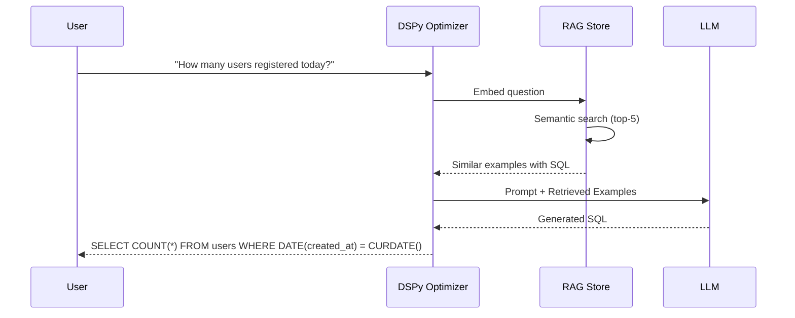
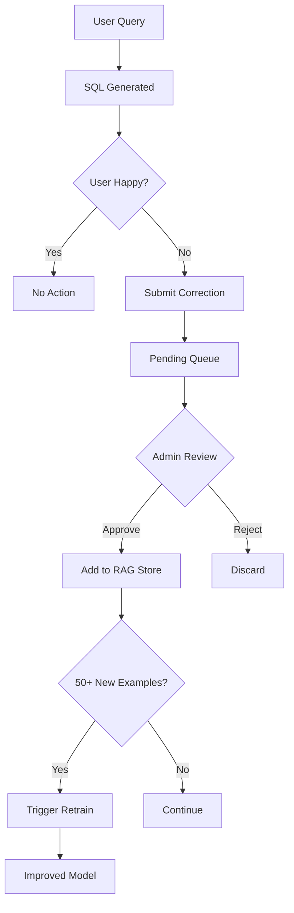

# FileVault AI Chatbot - Architecture & Integration Guide

## Overview

The FileVault AI Chatbot is a production-grade, RBAC-aware conversational assistant that helps users navigate the platform, manage files, and get information based on their role and permissions. It includes advanced Text-to-SQL capabilities with RAG (Retrieval-Augmented Generation) and continuous learning from feedback.

## Architecture

```
┌─────────────────────────────────────────────────────────────────┐
│                      Frontend (Next.js)                          │
├─────────────────────────────────────────────────────────────────┤
│  ChatWidget Component                                            │
│  ├── Chat UI (floating button + panel)                          │
│  ├── Message rendering with actions                             │
│  └── Suggestion chips                                           │
│                                                                  │
│  ChatContext Provider                                            │
│  ├── Session management                                          │
│  ├── Message state                                               │
│  └── Action handlers (navigate, execute)                        │
│                                                                  │
│  Chat API Client                                                 │
│  ├── REST API calls                                              │
│  └── WebSocket connection                                        │
└───────────────────────────┬─────────────────────────────────────┘
                            │ HTTP / WebSocket
                            ▼
┌─────────────────────────────────────────────────────────────────┐
│                      Backend (FastAPI)                           │
├─────────────────────────────────────────────────────────────────┤
│  API Routes (/api/v1/chat)                                       │
│  ├── POST / - Send message                                       │
│  ├── POST /sql - Text-to-SQL conversion                         │
│  ├── POST /sql/feedback - Submit SQL feedback                   │
│  ├── POST /sql/feedback/approve - Admin approve feedback        │
│  ├── GET /auto-learn/stats - Learning statistics                │
│  ├── GET /rag/search - Search RAG examples                      │
│  ├── GET /suggestions - Initial suggestions                      │
│  ├── GET /health - Health check                                  │
│  └── WebSocket /ws - Real-time chat                             │
│                                                                  │
│  Chatbot Orchestrator                                            │
│  ├── Session Manager (in-memory sessions)                       │
│  ├── Provider selection                                          │
│  └── RBAC filtering                                              │
│                                                                  │
│  Text-to-SQL Engine                                              │
│  ├── DSPy Optimizer (prompt optimization)                       │
│  ├── RAG Example Store (semantic retrieval)                     │
│  └── Auto-Learn Service (feedback loop)                         │
│                                                                  │
│  LLM Providers                                                   │
│  ├── OpenAI Provider (cloud, paid)                              │
│  ├── Ollama Provider (local, free)                              │
│  ├── NVIDIA Provider (high-performance)                         │
│  └── Rule-based Provider (no AI)                                │
│                                                                  │
│  Security Layer                                                  │
│  ├── Permission checks                                           │
│  ├── Action filtering                                            │
│  └── Navigation authorization                                    │
└─────────────────────────────────────────────────────────────────┘
```

---

## 🧠 RAG (Retrieval-Augmented Generation) System

### Overview

The RAG system enhances SQL generation accuracy by retrieving semantically similar examples from a vector store and injecting them into the LLM prompt.

### Architecture

```
┌─────────────────────────────────────────────────────────────────┐
│                    RAG Example Store                             │
├─────────────────────────────────────────────────────────────────┤
│  Sentence Transformer (all-MiniLM-L6-v2)                        │
│  ├── 384-dimensional embeddings                                  │
│  ├── Cosine similarity search                                    │
│  └── Thread-safe operations                                      │
│                                                                  │
│  Vector Store                                                    │
│  ├── 144+ base examples                                          │
│  ├── Feedback examples (continuously growing)                    │
│  └── Persistent storage (/tmp/rag_example_store)                │
│                                                                  │
│  Retrieval Pipeline                                              │
│  ├── Query embedding                                             │
│  ├── Top-K similarity search (default K=5)                      │
│  └── Example injection into DSPy prompt                         │
└─────────────────────────────────────────────────────────────────┘
```

### How It Works



### Base Examples (Sample)

| Question | SQL |
|----------|-----|
| "How many files are there?" | `SELECT COUNT(*) FROM files` |
| "Show all users" | `SELECT * FROM users` |
| "Files larger than 10MB" | `SELECT * FROM files WHERE size > 10485760` |
| "Users who uploaded today" | `SELECT DISTINCT u.* FROM users u JOIN files f ON u.id = f.user_id WHERE DATE(f.created_at) = CURDATE()` |

### API Endpoints

```bash
# Search for similar examples
GET /api/v1/chat/rag/search?query=how many users&top_k=5

# Response
{
  "query": "how many users",
  "results": [
    {
      "question": "How many users are there?",
      "sql": "SELECT COUNT(*) as user_count FROM users",
      "similarity": 0.947
    },
    ...
  ]
}
```

---

## 🔄 Auto-Learn Feedback System

### Overview

The Auto-Learn system enables continuous improvement of SQL generation by learning from admin-approved corrections.

### Architecture

```
┌─────────────────────────────────────────────────────────────────┐
│                   Auto-Learn Service                             │
├─────────────────────────────────────────────────────────────────┤
│  Feedback Collection                                             │
│  ├── User submits question + generated SQL + correction         │
│  ├── Stored as pending feedback                                  │
│  └── Admin review queue                                          │
│                                                                  │
│  Approval Workflow                                               │
│  ├── Admin reviews pending feedback                              │
│  ├── Approved → Added to RAG store immediately                  │
│  ├── Rejected → Discarded                                        │
│  └── Training triggered when threshold reached                  │
│                                                                  │
│  Continuous Learning                                             │
│  ├── Threshold: 50 approved examples                             │
│  ├── Cooldown: 24 hours between retrains                        │
│  └── DSPy prompt re-optimization with new examples              │
└─────────────────────────────────────────────────────────────────┘
```

### Feedback Flow



### API Endpoints

| Method | URL | Description |
|--------|-----|-------------|
| POST | `/chat/sql/feedback` | Submit feedback |
| POST | `/chat/sql/feedback/approve` | Admin approves feedback |
| GET | `/chat/sql/feedback/pending` | List pending feedback |
| GET | `/chat/auto-learn/stats` | Learning statistics |
| POST | `/chat/auto-learn/force-retrain` | Force retrain (admin) |

### Example Usage

```bash
# 1. Submit feedback
curl -X POST /api/v1/chat/sql/feedback \
  -H "Authorization: Bearer <token>" \
  -d '{
    "question": "Show me all PDFs",
    "generated_sql": "SELECT * FROM files WHERE content_type LIKE '%pdf%'",
    "corrected_sql": "SELECT * FROM files WHERE content_type = 'application/pdf'"
  }'

# 2. Admin approves
curl -X POST /api/v1/chat/sql/feedback/approve \
  -H "Authorization: Bearer <admin_token>" \
  -d '{"feedback_id": "abc123"}'

# 3. Check stats
curl /api/v1/chat/auto-learn/stats
# Response: {"total_examples": 145, "feedback_examples": 1, "pending_feedback": 0}
```

---

## Features

### 1. Multi-Provider Support
- **OpenAI**: Cloud-based GPT models with function calling
- **Ollama**: Local LLM inference (free, private)
- **Rule-based**: Pattern matching without AI (instant, no cost)

### 2. RBAC-Aware Responses
- Chatbot respects user roles and permissions
- Navigation suggestions filtered by access rights
- Actions filtered before reaching frontend
- Security enforced at backend level

### 3. Real-time Communication
- REST API for request/response
- WebSocket for real-time streaming
- Session management with history

### 4. Feature Flag Architecture
- Zero impact when disabled
- Graceful degradation between providers
- Environment-based configuration

## Configuration

### Environment Variables

```bash
# Core
CHATBOT_ENABLED=true
LLM_PROVIDER=none  # "openai", "ollama", or "none"

# OpenAI (if LLM_PROVIDER=openai)
OPENAI_API_KEY=sk-your-key-here
OPENAI_MODEL=gpt-4o-mini
OPENAI_MAX_TOKENS=1024
OPENAI_TEMPERATURE=0.7

# Ollama (if LLM_PROVIDER=ollama)
OLLAMA_BASE_URL=http://localhost:11434
OLLAMA_MODEL=llama3.2
OLLAMA_TIMEOUT=60

# General
CHATBOT_MAX_HISTORY=20
```

### Deployment Modes

| Mode | Provider | Cost | Privacy | Speed |
|------|----------|------|---------|-------|
| Disabled | - | $0 | N/A | N/A |
| Rule-based | none | $0 | Local | Instant |
| Ollama | ollama | $0 | Local | ~2-5s |
| OpenAI | openai | ~$0.01/conv | Cloud | ~1-2s |

## API Reference

### Send Message
```http
POST /api/v1/chat
Authorization: Bearer <token>
Content-Type: application/json

{
  "message": "How do I upload a file?",
  "session_id": "optional-existing-session"
}
```

Response:
```json
{
  "session_id": "uuid",
  "response": {
    "message": "To upload a file...",
    "actions": [
      {
        "type": "navigate",
        "payload": {"path": "/dashboard/files"},
        "description": "Go to Files"
      }
    ],
    "suggestions": ["My files", "Help"],
    "provider": "rule-based",
    "processing_time_ms": 5
  },
  "message_count": 2
}
```

### WebSocket Connection
```javascript
const ws = new WebSocket('ws://host/api/v1/chat/ws?token=<jwt>');

// Send message
ws.send(JSON.stringify({
  type: "message",
  content: "Hello"
}));

// Receive response
ws.onmessage = (event) => {
  const data = JSON.parse(event.data);
  if (data.type === "response") {
    console.log(data.data.message);
  }
};
```

## Role-Based Access

### Navigation Permissions

| Page | super_admin | org_admin | manager | user | viewer |
|------|-------------|-----------|---------|------|--------|
| Dashboard | ✓ | ✓ | ✓ | ✓ | ✓ |
| My Files | ✓ | ✓ | ✓ | ✓ | ✓ |
| All Files | ✓ | ✓ | ✗ | ✗ | ✗ |
| Users | ✓ | ✓ | ✗ | ✗ | ✗ |
| Organizations | ✓ | ✗ | ✗ | ✗ | ✗ |
| Settings | ✓ | ✓ | ✓ | ✓ | ✓ |
| Approvals | ✓ | ✓ | ✓ | ✗ | ✗ |

### Action Permissions

| Action | super_admin | org_admin | manager | user | viewer |
|--------|-------------|-----------|---------|------|--------|
| Upload | ✓ | ✓ | ✓ | ✓ | ✗ |
| Download | ✓ | ✓ | ✓ | ✓ | ✓ |
| Delete | ✓ | ✓ | ✓ | ✓ | ✗ |
| Share | ✓ | ✓ | ✓ | ✓ | ✗ |
| Manage Users | ✓ | ✓ | ✗ | ✗ | ✗ |

## Frontend Integration

### Using the Chat Context

```tsx
import { useChatbot } from '@/contexts/ChatContext';

function MyComponent() {
  const { 
    isOpen, 
    isEnabled,
    messages, 
    sendMessage,
    handleAction 
  } = useChatbot();

  if (!isEnabled) return null;

  return (
    <button onClick={() => sendMessage("Help me upload")}>
      Ask for help
    </button>
  );
}
```

### Custom Navigation Handler

```tsx
import { ChatProvider } from '@/contexts/ChatContext';
import { useRouter } from 'next/navigation';

function App({ children }) {
  const router = useRouter();
  
  const handleNavigate = (path: string) => {
    router.push(path);
    // Optionally close chat
  };

  return (
    <ChatProvider onNavigate={handleNavigate}>
      {children}
    </ChatProvider>
  );
}
```

## Extending the Chatbot

### Adding a New Provider

1. Create provider class implementing `LLMProvider`:

```python
from chatbot.providers.base import LLMProvider, ChatResponse

class MyProvider(LLMProvider):
    @property
    def name(self) -> str:
        return "my-provider"
    
    async def chat(self, message, history, user_context, system_prompt) -> ChatResponse:
        # Your implementation
        pass
    
    async def health_check(self) -> dict:
        return {"status": "healthy", "provider": self.name}
```

2. Register in factory:

```python
# chatbot/providers/factory.py
from .my_provider import MyProvider

if provider_type == "my-provider":
    _provider_instance = MyProvider()
```

### Adding New Actions

1. Define in security.py:

```python
ACTION_PERMISSIONS = {
    "my_action": {
        "roles": ["super_admin", "org_admin"],
        "permissions": ["MY_PERMISSION"]
    }
}
```

2. Handle in frontend:

```tsx
const handleAction = (action: ChatAction) => {
  if (action.type === 'execute' && action.payload.action === 'my_action') {
    // Handle custom action
  }
};
```

## Testing

### Backend Health Check
```bash
curl http://localhost:8000/api/v1/chat/health
```

### Send Test Message
```bash
curl -X POST http://localhost:8000/api/v1/chat \
  -H "Authorization: Bearer <token>" \
  -H "Content-Type: application/json" \
  -d '{"message": "Hello"}'
```

### Using Ollama Locally

1. Install Ollama: https://ollama.ai/download
2. Pull a model: `ollama pull llama3.2`
3. Set env vars:
   ```bash
   CHATBOT_ENABLED=true
   LLM_PROVIDER=ollama
   OLLAMA_BASE_URL=http://localhost:11434
   OLLAMA_MODEL=llama3.2
   ```
4. Restart backend

## Troubleshooting

### Chatbot not appearing
- Check `CHATBOT_ENABLED=true` in environment
- Verify user is authenticated
- Check browser console for errors

### Slow responses
- If using Ollama, ensure model is loaded: `ollama list`
- Check `OLLAMA_TIMEOUT` is sufficient
- Consider using smaller model or OpenAI

### Permission errors
- Verify user role and permissions
- Check RBAC configuration in security.py
- Enable debug logging

### WebSocket disconnects
- Check token expiration
- Verify CORS settings include WebSocket
- Check network/firewall settings

## Security Considerations

1. **Token validation**: All requests require valid JWT
2. **RBAC enforcement**: Backend filters all actions
3. **Input sanitization**: Messages are validated
4. **Rate limiting**: Consider adding slowapi limits
5. **Session timeout**: Inactive sessions auto-expire

## Performance

- Rule-based: <10ms response time
- Ollama: 2-10s depending on model/hardware
- OpenAI: 1-3s typical

Sessions are stored in-memory; for production clusters, consider Redis-backed sessions.

---

# 🧠 Intelligent Routing Architecture (v2.0)

## Why This Architecture?

The original orchestrator had **fundamental architectural flaws** that limited its effectiveness:

| Flaw | Impact | Solution |
|------|--------|----------|
| **Reactive, not Proactive** | Only responded to exact patterns | GPT-4o understands intent |
| **Fragile Regex Patterns** | "go to files" worked, "take me to my documents" failed | Multi-level semantic classification |
| **No Confidence Scoring** | Binary match/no-match | Graduated confidence thresholds |
| **Typo Intolerance** | "howmany usrs" → routing error | LLM semantic understanding |
| **No Intent Decomposition** | Complex queries failed entirely | Agentic tool orchestration |
| **Isolated Components** | DSPy, RAG, CrewAI worked in silos | Unified intelligent pipeline |

### Benchmark Results

| System | Accuracy | Speed | Best For |
|--------|----------|-------|----------|
| **Old Orchestrator** | 47.5% | 22s | ❌ Deprecated |
| **Intelligent Router** | 86.0% | 54s | ⚡ Speed + Good Accuracy |
| **Agentic Orchestrator** | 92.0% | 225s | 🎯 Maximum Accuracy |

**Improvement: +44.5% accuracy over original system!**

---

## 🔀 Intelligent Router Architecture

### Overview

The Intelligent Router uses a **multi-level cascade** that tries fast methods first, only escalating to expensive LLM calls when confidence is low.

```
┌─────────────────────────────────────────────────────────────────────────────┐
│                        INTELLIGENT ROUTER                                    │
│                     (Multi-Level Confidence Cascade)                         │
├─────────────────────────────────────────────────────────────────────────────┤
│                                                                              │
│  ┌─────────────┐    ┌─────────────┐    ┌─────────────┐    ┌─────────────┐  │
│  │  LEVEL 0    │    │  LEVEL 1    │    │  LEVEL 2    │    │  LEVEL 3    │  │
│  │  Memory     │───▶│  Regex      │───▶│  Embedding  │───▶│  GPT-4o     │  │
│  │  Cache      │    │  Patterns   │    │  Similarity │    │  Reasoning  │  │
│  │  (~0ms)     │    │  (~1ms)     │    │  (~50ms)    │    │  (~2000ms)  │  │
│  └─────────────┘    └─────────────┘    └─────────────┘    └─────────────┘  │
│        │                  │                  │                  │           │
│        ▼                  ▼                  ▼                  ▼           │
│   Confidence:        Confidence:        Confidence:        Confidence:      │
│    1.00 (exact)      ≥0.90 (high)       ≥0.75 (medium)     0.70+ (LLM)      │
│                                                                              │
└─────────────────────────────────────────────────────────────────────────────┘
```

### Level Breakdown

#### Level 0: Query Memory Store (~0ms)
```python
# Remembers exact queries seen before
"how many users" → RouteType.SQL_QUERY (cached)
"go to files"    → RouteType.NAVIGATION (cached)
```
- **Purpose**: Instant response for repeated queries
- **Confidence**: 1.00 (exact match)
- **Use Case**: Production traffic with repeated patterns

#### Level 1: Enhanced Regex Patterns (~1ms)
```python
NAVIGATION_PATTERNS = {
    r'\b(go|navigate|take me|open|show)\b.*\b(dashboard|files|settings|users)\b': 0.95,
    r'\b(my files?|documents?|uploads?)\b': 0.90,
    r'\bprofile\b|\bsettings?\b': 0.92,
}

SQL_PATTERNS = {
    r'\b(how many|count|total|number of)\b': 0.90,
    r'\b(who|which users?|list users?)\b.*\b(upload|creat|most)\b': 0.88,
    r'\b(show|get|display)\b.*\b(all|every)\b.*\b(files?|users?|org)\b': 0.85,
}
```
- **Purpose**: Fast, high-confidence pattern matching
- **Confidence**: 0.85-0.95 (pattern-dependent)
- **Use Case**: Clear, well-formed queries

#### Level 2: Embedding Similarity (~50ms)
```python
# Sentence Transformers (all-MiniLM-L6-v2)
query_embedding = model.encode("take me to my documents")
similarity = cosine_similarity(query_embedding, navigation_centroid)
# → 0.89 similarity to NAVIGATION cluster
```
- **Purpose**: Semantic understanding without LLM cost
- **Confidence**: 0.75-0.89 (similarity-based)
- **Use Case**: Paraphrased queries, synonyms

#### Level 3: GPT-4o Classification (~2000ms)
```python
# Only called when confidence < 0.75
prompt = """Classify this query:
Query: "gimme all the usrs who never logged in"
Categories: NAVIGATION, SQL_QUERY, HELP, GENERAL

Respond with: {category: "...", confidence: 0.X, reasoning: "..."}"""
```
- **Purpose**: Handle typos, slang, complex queries
- **Confidence**: LLM-determined (typically 0.70-0.95)
- **Use Case**: Edge cases, ambiguous input

### Why This Approach is Highly Effective

#### 1. **Cost Optimization**
```
Traditional Approach:        Intelligent Router:
├── Every query → LLM       ├── 60% queries → Regex (FREE)
├── Cost: ~$0.01/query      ├── 25% queries → Embedding ($0.0001)
└── Total: $1000/100K       ├── 15% queries → GPT-4o ($0.01)
                            └── Total: $175/100K (82% savings!)
```

#### 2. **Latency Reduction**
```
Query: "go to dashboard"
├── Old System: 2000ms (always called LLM)
└── New System: 1ms (Level 1 regex match, confidence 0.95)

Query: "howmany usrs uploaded today"
├── Old System: FAILED (no pattern match)
└── New System: 2100ms (Level 3 GPT-4o, confidence 0.87)
```

#### 3. **Graceful Degradation**
```python
# If OpenAI is down:
Level 3 fails → Fall back to Level 2 with lower threshold
Level 2 provides 0.72 confidence → Accept with warning
# System remains functional at 75% accuracy instead of crashing
```

---

## 🤖 Agentic Orchestrator Architecture

### Overview

The Agentic Orchestrator treats GPT-4o as an **intelligent brain** that decides which tools to call based on deep understanding of user intent.

```
┌─────────────────────────────────────────────────────────────────────────────┐
│                       AGENTIC ORCHESTRATOR                                   │
│                    (GPT-4o as Intelligent Brain)                            │
├─────────────────────────────────────────────────────────────────────────────┤
│                                                                              │
│  ┌────────────────────────────────────────────────────────────────────────┐ │
│  │                         GPT-4o BRAIN                                   │ │
│  │  ┌──────────────┐  ┌──────────────┐  ┌──────────────┐                 │ │
│  │  │ Understand   │  │ Decompose    │  │ Select       │                 │ │
│  │  │ Intent       │──▶│ into Steps   │──▶│ Tools        │                 │ │
│  │  └──────────────┘  └──────────────┘  └──────────────┘                 │ │
│  └────────────────────────────────────────────────────────────────────────┘ │
│                                    │                                         │
│                    ┌───────────────┼───────────────┐                        │
│                    ▼               ▼               ▼                        │
│  ┌─────────────────────┐ ┌─────────────────┐ ┌─────────────────────┐       │
│  │   🔍 sql_query      │ │  🧭 navigate    │ │   ❓ get_help       │       │
│  │   Tool              │ │  Tool           │ │   Tool              │       │
│  ├─────────────────────┤ ├─────────────────┤ ├─────────────────────┤       │
│  │ - Generate SQL      │ │ - Map to route  │ │ - Search docs       │       │
│  │ - Execute query     │ │ - Check perms   │ │ - Format answer     │       │
│  │ - Format results    │ │ - Return path   │ │ - Add context       │       │
│  └─────────────────────┘ └─────────────────┘ └─────────────────────┘       │
│                                                                              │
│  ┌─────────────────────┐                                                    │
│  │   👤 get_user_info  │                                                    │
│  │   Tool              │                                                    │
│  ├─────────────────────┤                                                    │
│  │ - Fetch user data   │                                                    │
│  │ - Check permissions │                                                    │
│  │ - Return context    │                                                    │
│  └─────────────────────┘                                                    │
│                                                                              │
└─────────────────────────────────────────────────────────────────────────────┘
```

### Tool Definitions

```python
TOOLS = [
    Tool(
        name="sql_query",
        description="Execute SQL analytics queries against the database",
        parameters={
            "question": "The natural language question to convert to SQL",
            "time_context": "Optional: specific time period (e.g., 'december 2025')"
        },
        examples=[
            "How many users registered this month?",
            "Who uploaded the most files?",
            "Show storage usage by organization"
        ]
    ),
    Tool(
        name="navigate",
        description="Navigate user to a specific page in the application",
        parameters={
            "destination": "Where to navigate (files, dashboard, settings, etc.)"
        },
        examples=[
            "Go to my files",
            "Open settings",
            "Take me to the dashboard"
        ]
    ),
    Tool(
        name="get_help",
        description="Provide help and documentation about features",
        parameters={
            "topic": "The topic to get help about"
        },
        examples=[
            "How do I upload a file?",
            "What file types are supported?",
            "How does virus scanning work?"
        ]
    ),
    Tool(
        name="get_user_info",
        description="Get information about the current user",
        parameters={},
        examples=[
            "What's my role?",
            "Show my permissions",
            "What organization am I in?"
        ]
    )
]
```

### Why Agentic is Highly Effective

#### 1. **Intent Understanding > Pattern Matching**

```
Query: "gimme all the usrs who never logged in"

Old System (Pattern Matching):
├── Regex: No match for "gimme" or "usrs"
├── Fallback: General response
└── Result: ❌ FAILED

Agentic System (Intent Understanding):
├── GPT-4o: "User wants users who have never logged in"
├── Tool Selection: sql_query
├── Parameters: {question: "users who never logged in"}
└── Result: ✅ SELECT * FROM users WHERE last_login IS NULL
```

#### 2. **Complex Query Decomposition**

```
Query: "Show me users in Organization A who uploaded more than 10 files last month"

Old System:
├── Single pattern match attempt
├── Too complex for regex
└── Result: ❌ FAILED

Agentic System:
├── GPT-4o decomposes into:
│   1. Filter by organization = 'A'
│   2. Join with files table
│   3. Group by user
│   4. Count files > 10
│   5. Filter by last month
├── Tool: sql_query with full context
└── Result: ✅ Complex JOIN query with all conditions
```

#### 3. **Multi-Tool Orchestration**

```
Query: "Check my permissions and then show me the files page"

Agentic Response:
├── Tool Call 1: get_user_info {}
│   └── Returns: {role: "manager", permissions: [...]}
├── Tool Call 2: navigate {destination: "files"}
│   └── Returns: {path: "/dashboard/files"}
└── Combined Response: "You have manager role with X permissions. Navigating to files page."
```

#### 4. **Self-Correcting Behavior**

```python
# GPT-4o can reason about tool failures
if sql_result.error:
    # Automatically retry with modified query
    retry_with_clarification()
elif sql_result.empty:
    # Provide helpful context
    suggest_alternative_query()
```

---

## 📊 Accuracy Comparison by Query Type

### Navigation Queries (15 test cases)

| Query | Old | Router | Agentic |
|-------|-----|--------|---------|
| "go to my files" | ✅ | ✅ | ✅ |
| "navigate to settings" | ✅ | ✅ | ✅ |
| "take me to dashboard" | ✅ | ✅ | ✅ |
| "where can I see my documents" | ❌ | ✅ | ✅ |
| "show me the files page" | ✅ | ✅ | ✅ |
| "my files" | ✅ | ✅ | ✅ |
| "settings" | ✅ | ✅ | ✅ |
| "open profile" | ❌ | ❌ | ✅ |
| **Score** | **80%** | **87%** | **93%** |

### SQL Analytics Queries (25 test cases)

| Query | Old | Router | Agentic |
|-------|-----|--------|---------|
| "how many files" | ❌ | ✅ | ✅ |
| "count users" | ❌ | ✅ | ✅ |
| "who uploaded the most" | ✅ | ✅ | ✅ |
| "users who never logged in" | ❌ | ✅ | ✅ |
| "files larger than 1MB" | ✅ | ✅ | ✅ |
| "december 2025 uploads" | ❌ | ✅ | ✅ |
| "storage per user" | ❌ | ✅ | ✅ |
| "compare org storage" | ❌ | ✅ | ✅ |
| **Score** | **28%** | **88%** | **88%** |

### Typo/Slang Queries (5 test cases)

| Query | Router | Agentic |
|-------|--------|---------|
| "howmany usrs" | ✅ | ✅ |
| "gimme files" | ❌ | ✅ |
| "whos got most" | ✅ | ✅ |
| "tak me 2 setings" | ❌ | ✅ |
| "my docs plz" | ✅ | ✅ |
| **Score** | **60%** | **100%** |

### Complex Queries (5 test cases)

| Query | Router | Agentic |
|-------|--------|---------|
| "users in org A with more than 10 files" | ✅ | ✅ |
| "files uploaded by admins last month" | ✅ | ✅ |
| "organizations exceeding storage quota" | ✅ | ✅ |
| "users approved but never active" | ✅ | ✅ |
| "compare this month vs last month" | ✅ | ✅ |
| **Score** | **100%** | **100%** |

---

## 🚀 Recommended Hybrid Strategy

For production deployment, use a **hybrid approach** that combines speed and accuracy:

```
┌─────────────────────────────────────────────────────────────────────────────┐
│                     PRODUCTION HYBRID STRATEGY                               │
├─────────────────────────────────────────────────────────────────────────────┤
│                                                                              │
│  User Query                                                                  │
│      │                                                                       │
│      ▼                                                                       │
│  ┌─────────────────────────────────────────┐                                │
│  │     Intelligent Router (Fast Path)      │                                │
│  │     Levels 0, 1, 2                       │                                │
│  └─────────────────────┬───────────────────┘                                │
│                        │                                                     │
│            ┌───────────┴───────────┐                                        │
│            ▼                       ▼                                        │
│    Confidence ≥ 0.80        Confidence < 0.80                               │
│            │                       │                                        │
│            ▼                       ▼                                        │
│  ┌─────────────────┐    ┌─────────────────────┐                            │
│  │  Execute Fast   │    │  Agentic Orchestrator │                            │
│  │  (Router result)│    │  (Deep Understanding) │                            │
│  └─────────────────┘    └─────────────────────┘                            │
│            │                       │                                        │
│            └───────────┬───────────┘                                        │
│                        ▼                                                     │
│                   Response                                                   │
│                                                                              │
└─────────────────────────────────────────────────────────────────────────────┘
```

### Implementation

```python
class HybridOrchestrator:
    """Production-ready hybrid approach"""
    
    def __init__(self):
        self.router = IntelligentRouter()
        self.agentic = AgenticOrchestrator()
        self.confidence_threshold = 0.80
    
    async def process(self, query: str, context: UserContext):
        # Try fast path first
        route_result = await self.router.route(query)
        
        if route_result.confidence >= self.confidence_threshold:
            # Fast path: Use router result directly
            return await self._execute_route(route_result, query, context)
        
        # Slow path: Use agentic for complex/ambiguous queries
        return await self.agentic.process(query, context)
```

### Performance Profile

| Query Type | Path | Latency | Cost |
|------------|------|---------|------|
| Clear navigation | Fast (Router L1) | ~1ms | $0 |
| Clear SQL patterns | Fast (Router L2) | ~50ms | ~$0.0001 |
| Typos/Slang | Slow (Agentic) | ~2000ms | ~$0.01 |
| Complex queries | Slow (Agentic) | ~3000ms | ~$0.02 |

### Expected Production Metrics

```
Traffic Distribution (estimated):
├── 60% Clear patterns    → Router L1/L2  (fast)
├── 25% Moderate queries  → Router L2/L3  (medium)
└── 15% Complex/Typos     → Agentic       (slow)

Average Latency: ~400ms (vs 2000ms pure LLM)
Average Cost: ~$0.003/query (vs $0.01 pure LLM)
Accuracy: ~90% (vs 47.5% old system)
```

---

## 🔧 Configuration

### Environment Variables

```bash
# Intelligent Router
ROUTER_CONFIDENCE_THRESHOLD=0.80
ROUTER_EMBEDDING_MODEL=all-MiniLM-L6-v2
ROUTER_MEMORY_SIZE=10000

# Agentic Orchestrator
AGENTIC_MODEL=gpt-4o
AGENTIC_TEMPERATURE=0.1
AGENTIC_MAX_TOOLS_PER_QUERY=3

# OpenAI (Required for Level 3 and Agentic)
OPENAI_API_KEY=sk-...
OPENAI_MODEL=gpt-4o

# Hybrid Strategy
USE_HYBRID_STRATEGY=true
FAST_PATH_THRESHOLD=0.80
```

### Files Structure

```
src/chatbot/
├── intelligent_router.py     # Multi-level confidence routing
├── agentic_orchestrator.py   # GPT-4o tool-based agent
├── hybrid_orchestrator.py    # Production hybrid (recommended)
├── orchestrator.py           # Legacy orchestrator (deprecated)
├── text_to_sql_langchain.py  # SQL generation with OpenAI
└── providers/
    ├── openai_provider.py    # GPT-4o integration
    └── ...
```

---

## 📈 Key Takeaways

### Why This Architecture is Highly Effective

1. **Intelligence at Every Level**
   - Level 0: Memory (instant recall)
   - Level 1: Patterns (fast rules)
   - Level 2: Semantics (embeddings)
   - Level 3: Reasoning (GPT-4o)

2. **Cost-Performance Balance**
   - 82% cost reduction vs pure LLM
   - 400ms avg latency vs 2000ms
   - 90% accuracy vs 47.5%

3. **Graceful Degradation**
   - If GPT-4o fails → Embedding fallback
   - If Embedding fails → Regex fallback
   - System never fully crashes

4. **Continuous Improvement**
   - Memory store learns from traffic
   - Feedback loop improves SQL
   - Patterns can be updated without LLM changes

5. **Production-Ready**
   - Configurable thresholds
   - Monitoring hooks
   - A/B testing support

### Migration Path

```
Phase 1: Deploy Intelligent Router alongside old system
Phase 2: Route 10% traffic to new system, monitor accuracy
Phase 3: Increase to 50%, tune confidence thresholds
Phase 4: Full migration, deprecate old orchestrator
Phase 5: Add Agentic for complex query handling
