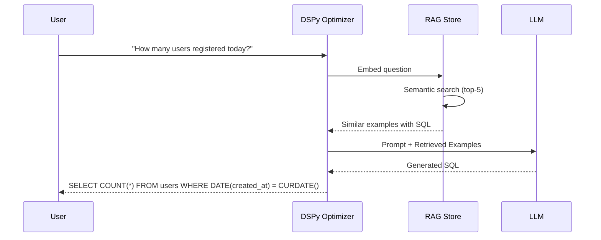
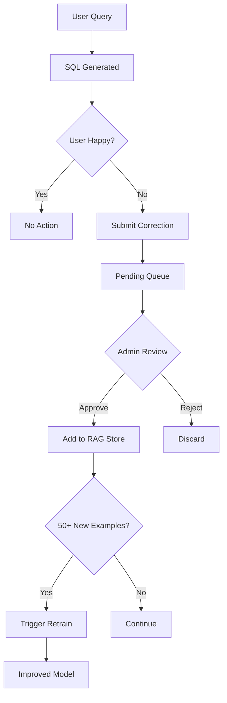

# FileVault AI Chatbot - Architecture & Integration Guide

## Overview

The FileVault AI Chatbot is a production-grade, RBAC-aware conversational assistant that helps users navigate the platform, manage files, and get information based on their role and permissions. It includes advanced Text-to-SQL capabilities with RAG (Retrieval-Augmented Generation) and continuous learning from feedback.

## Architecture

```
┌─────────────────────────────────────────────────────────────────┐
│                      Frontend (Next.js)                          │
├─────────────────────────────────────────────────────────────────┤
│  ChatWidget Component                                            │
│  ├── Chat UI (floating button + panel)                          │
│  ├── Message rendering with actions                             │
│  └── Suggestion chips                                           │
│                                                                  │
│  ChatContext Provider                                            │
│  ├── Session management                                          │
│  ├── Message state                                               │
│  └── Action handlers (navigate, execute)                        │
│                                                                  │
│  Chat API Client                                                 │
│  ├── REST API calls                                              │
│  └── WebSocket connection                                        │
└───────────────────────────┬─────────────────────────────────────┘
                            │ HTTP / WebSocket
                            ▼
┌─────────────────────────────────────────────────────────────────┐
│                      Backend (FastAPI)                           │
├─────────────────────────────────────────────────────────────────┤
│  API Routes (/api/v1/chat)                                       │
│  ├── POST / - Send message                                       │
│  ├── POST /sql - Text-to-SQL conversion                         │
│  ├── POST /sql/feedback - Submit SQL feedback                   │
│  ├── POST /sql/feedback/approve - Admin approve feedback        │
│  ├── GET /auto-learn/stats - Learning statistics                │
│  ├── GET /rag/search - Search RAG examples                      │
│  ├── GET /suggestions - Initial suggestions                      │
│  ├── GET /health - Health check                                  │
│  └── WebSocket /ws - Real-time chat                             │
│                                                                  │
│  Chatbot Orchestrator                                            │
│  ├── Session Manager (in-memory sessions)                       │
│  ├── Provider selection                                          │
│  └── RBAC filtering                                              │
│                                                                  │
│  Text-to-SQL Engine                                              │
│  ├── DSPy Optimizer (prompt optimization)                       │
│  ├── RAG Example Store (semantic retrieval)                     │
│  └── Auto-Learn Service (feedback loop)                         │
│                                                                  │
│  LLM Providers                                                   │
│  ├── OpenAI Provider (cloud, paid)                              │
│  ├── Ollama Provider (local, free)                              │
│  ├── NVIDIA Provider (high-performance)                         │
│  └── Rule-based Provider (no AI)                                │
│                                                                  │
│  Security Layer                                                  │
│  ├── Permission checks                                           │
│  ├── Action filtering                                            │
│  └── Navigation authorization                                    │
└─────────────────────────────────────────────────────────────────┘
```

---

## 🧠 RAG (Retrieval-Augmented Generation) System

### Overview

The RAG system enhances SQL generation accuracy by retrieving semantically similar examples from a vector store and injecting them into the LLM prompt.

### Architecture

```
┌─────────────────────────────────────────────────────────────────┐
│                    RAG Example Store                             │
├─────────────────────────────────────────────────────────────────┤
│  Sentence Transformer (all-MiniLM-L6-v2)                        │
│  ├── 384-dimensional embeddings                                  │
│  ├── Cosine similarity search                                    │
│  └── Thread-safe operations                                      │
│                                                                  │
│  Vector Store                                                    │
│  ├── 144+ base examples                                          │
│  ├── Feedback examples (continuously growing)                    │
│  └── Persistent storage (/tmp/rag_example_store)                │
│                                                                  │
│  Retrieval Pipeline                                              │
│  ├── Query embedding                                             │
│  ├── Top-K similarity search (default K=5)                      │
│  └── Example injection into DSPy prompt                         │
└─────────────────────────────────────────────────────────────────┘
```

### How It Works



### Base Examples (Sample)

| Question | SQL |
|----------|-----|
| "How many files are there?" | `SELECT COUNT(*) FROM files` |
| "Show all users" | `SELECT * FROM users` |
| "Files larger than 10MB" | `SELECT * FROM files WHERE size > 10485760` |
| "Users who uploaded today" | `SELECT DISTINCT u.* FROM users u JOIN files f ON u.id = f.user_id WHERE DATE(f.created_at) = CURDATE()` |

### API Endpoints

```bash
# Search for similar examples
GET /api/v1/chat/rag/search?query=how many users&top_k=5

# Response
{
  "query": "how many users",
  "results": [
    {
      "question": "How many users are there?",
      "sql": "SELECT COUNT(*) as user_count FROM users",
      "similarity": 0.947
    },
    ...
  ]
}
```

---

## 🔄 Auto-Learn Feedback System

### Overview

The Auto-Learn system enables continuous improvement of SQL generation by learning from admin-approved corrections.

### Architecture

```
┌─────────────────────────────────────────────────────────────────┐
│                   Auto-Learn Service                             │
├─────────────────────────────────────────────────────────────────┤
│  Feedback Collection                                             │
│  ├── User submits question + generated SQL + correction         │
│  ├── Stored as pending feedback                                  │
│  └── Admin review queue                                          │
│                                                                  │
│  Approval Workflow                                               │
│  ├── Admin reviews pending feedback                              │
│  ├── Approved → Added to RAG store immediately                  │
│  ├── Rejected → Discarded                                        │
│  └── Training triggered when threshold reached                  │
│                                                                  │
│  Continuous Learning                                             │
│  ├── Threshold: 50 approved examples                             │
│  ├── Cooldown: 24 hours between retrains                        │
│  └── DSPy prompt re-optimization with new examples              │
└─────────────────────────────────────────────────────────────────┘
```

### Feedback Flow



### API Endpoints

| Method | URL | Description |
|--------|-----|-------------|
| POST | `/chat/sql/feedback` | Submit feedback |
| POST | `/chat/sql/feedback/approve` | Admin approves feedback |
| GET | `/chat/sql/feedback/pending` | List pending feedback |
| GET | `/chat/auto-learn/stats` | Learning statistics |
| POST | `/chat/auto-learn/force-retrain` | Force retrain (admin) |

### Example Usage

```bash
# 1. Submit feedback
curl -X POST /api/v1/chat/sql/feedback \
  -H "Authorization: Bearer <token>" \
  -d '{
    "question": "Show me all PDFs",
    "generated_sql": "SELECT * FROM files WHERE content_type LIKE '%pdf%'",
    "corrected_sql": "SELECT * FROM files WHERE content_type = 'application/pdf'"
  }'

# 2. Admin approves
curl -X POST /api/v1/chat/sql/feedback/approve \
  -H "Authorization: Bearer <admin_token>" \
  -d '{"feedback_id": "abc123"}'

# 3. Check stats
curl /api/v1/chat/auto-learn/stats
# Response: {"total_examples": 145, "feedback_examples": 1, "pending_feedback": 0}
```

---

## Features

### 1. Multi-Provider Support
- **OpenAI**: Cloud-based GPT models with function calling
- **Ollama**: Local LLM inference (free, private)
- **Rule-based**: Pattern matching without AI (instant, no cost)

### 2. RBAC-Aware Responses
- Chatbot respects user roles and permissions
- Navigation suggestions filtered by access rights
- Actions filtered before reaching frontend
- Security enforced at backend level

### 3. Real-time Communication
- REST API for request/response
- WebSocket for real-time streaming
- Session management with history

### 4. Feature Flag Architecture
- Zero impact when disabled
- Graceful degradation between providers
- Environment-based configuration

## Configuration

### Environment Variables

```bash
# Core
CHATBOT_ENABLED=true
LLM_PROVIDER=none  # "openai", "ollama", or "none"

# OpenAI (if LLM_PROVIDER=openai)
OPENAI_API_KEY=sk-your-key-here
OPENAI_MODEL=gpt-4o-mini
OPENAI_MAX_TOKENS=1024
OPENAI_TEMPERATURE=0.7

# Ollama (if LLM_PROVIDER=ollama)
OLLAMA_BASE_URL=http://localhost:11434
OLLAMA_MODEL=llama3.2
OLLAMA_TIMEOUT=60

# General
CHATBOT_MAX_HISTORY=20
```

### Deployment Modes

| Mode | Provider | Cost | Privacy | Speed |
|------|----------|------|---------|-------|
| Disabled | - | $0 | N/A | N/A |
| Rule-based | none | $0 | Local | Instant |
| Ollama | ollama | $0 | Local | ~2-5s |
| OpenAI | openai | ~$0.01/conv | Cloud | ~1-2s |

## API Reference

### Send Message
```http
POST /api/v1/chat
Authorization: Bearer <token>
Content-Type: application/json

{
  "message": "How do I upload a file?",
  "session_id": "optional-existing-session"
}
```

Response:
```json
{
  "session_id": "uuid",
  "response": {
    "message": "To upload a file...",
    "actions": [
      {
        "type": "navigate",
        "payload": {"path": "/dashboard/files"},
        "description": "Go to Files"
      }
    ],
    "suggestions": ["My files", "Help"],
    "provider": "rule-based",
    "processing_time_ms": 5
  },
  "message_count": 2
}
```

### WebSocket Connection
```javascript
const ws = new WebSocket('ws://host/api/v1/chat/ws?token=<jwt>');

// Send message
ws.send(JSON.stringify({
  type: "message",
  content: "Hello"
}));

// Receive response
ws.onmessage = (event) => {
  const data = JSON.parse(event.data);
  if (data.type === "response") {
    console.log(data.data.message);
  }
};
```

## Role-Based Access

### Navigation Permissions

| Page | super_admin | org_admin | manager | user | viewer |
|------|-------------|-----------|---------|------|--------|
| Dashboard | ✓ | ✓ | ✓ | ✓ | ✓ |
| My Files | ✓ | ✓ | ✓ | ✓ | ✓ |
| All Files | ✓ | ✓ | ✗ | ✗ | ✗ |
| Users | ✓ | ✓ | ✗ | ✗ | ✗ |
| Organizations | ✓ | ✗ | ✗ | ✗ | ✗ |
| Settings | ✓ | ✓ | ✓ | ✓ | ✓ |
| Approvals | ✓ | ✓ | ✓ | ✗ | ✗ |

### Action Permissions

| Action | super_admin | org_admin | manager | user | viewer |
|--------|-------------|-----------|---------|------|--------|
| Upload | ✓ | ✓ | ✓ | ✓ | ✗ |
| Download | ✓ | ✓ | ✓ | ✓ | ✓ |
| Delete | ✓ | ✓ | ✓ | ✓ | ✗ |
| Share | ✓ | ✓ | ✓ | ✓ | ✗ |
| Manage Users | ✓ | ✓ | ✗ | ✗ | ✗ |

## Frontend Integration

### Using the Chat Context

```tsx
import { useChatbot } from '@/contexts/ChatContext';

function MyComponent() {
  const { 
    isOpen, 
    isEnabled,
    messages, 
    sendMessage,
    handleAction 
  } = useChatbot();

  if (!isEnabled) return null;

  return (
    <button onClick={() => sendMessage("Help me upload")}>
      Ask for help
    </button>
  );
}
```

### Custom Navigation Handler

```tsx
import { ChatProvider } from '@/contexts/ChatContext';
import { useRouter } from 'next/navigation';

function App({ children }) {
  const router = useRouter();
  
  const handleNavigate = (path: string) => {
    router.push(path);
    // Optionally close chat
  };

  return (
    <ChatProvider onNavigate={handleNavigate}>
      {children}
    </ChatProvider>
  );
}
```

## Extending the Chatbot

### Adding a New Provider

1. Create provider class implementing `LLMProvider`:

```python
from chatbot.providers.base import LLMProvider, ChatResponse

class MyProvider(LLMProvider):
    @property
    def name(self) -> str:
        return "my-provider"
    
    async def chat(self, message, history, user_context, system_prompt) -> ChatResponse:
        # Your implementation
        pass
    
    async def health_check(self) -> dict:
        return {"status": "healthy", "provider": self.name}
```

2. Register in factory:

```python
# chatbot/providers/factory.py
from .my_provider import MyProvider

if provider_type == "my-provider":
    _provider_instance = MyProvider()
```

### Adding New Actions

1. Define in security.py:

```python
ACTION_PERMISSIONS = {
    "my_action": {
        "roles": ["super_admin", "org_admin"],
        "permissions": ["MY_PERMISSION"]
    }
}
```

2. Handle in frontend:

```tsx
const handleAction = (action: ChatAction) => {
  if (action.type === 'execute' && action.payload.action === 'my_action') {
    // Handle custom action
  }
};
```

## Testing

### Backend Health Check
```bash
curl http://localhost:8000/api/v1/chat/health
```

### Send Test Message
```bash
curl -X POST http://localhost:8000/api/v1/chat \
  -H "Authorization: Bearer <token>" \
  -H "Content-Type: application/json" \
  -d '{"message": "Hello"}'
```

### Using Ollama Locally

1. Install Ollama: https://ollama.ai/download
2. Pull a model: `ollama pull llama3.2`
3. Set env vars:
   ```bash
   CHATBOT_ENABLED=true
   LLM_PROVIDER=ollama
   OLLAMA_BASE_URL=http://localhost:11434
   OLLAMA_MODEL=llama3.2
   ```
4. Restart backend

## Troubleshooting

### Chatbot not appearing
- Check `CHATBOT_ENABLED=true` in environment
- Verify user is authenticated
- Check browser console for errors

### Slow responses
- If using Ollama, ensure model is loaded: `ollama list`
- Check `OLLAMA_TIMEOUT` is sufficient
- Consider using smaller model or OpenAI

### Permission errors
- Verify user role and permissions
- Check RBAC configuration in security.py
- Enable debug logging

### WebSocket disconnects
- Check token expiration
- Verify CORS settings include WebSocket
- Check network/firewall settings

## Security Considerations

1. **Token validation**: All requests require valid JWT
2. **RBAC enforcement**: Backend filters all actions
3. **Input sanitization**: Messages are validated
4. **Rate limiting**: Consider adding slowapi limits
5. **Session timeout**: Inactive sessions auto-expire

## Performance

- Rule-based: <10ms response time
- Ollama: 2-10s depending on model/hardware
- OpenAI: 1-3s typical

Sessions are stored in-memory; for production clusters, consider Redis-backed sessions.
