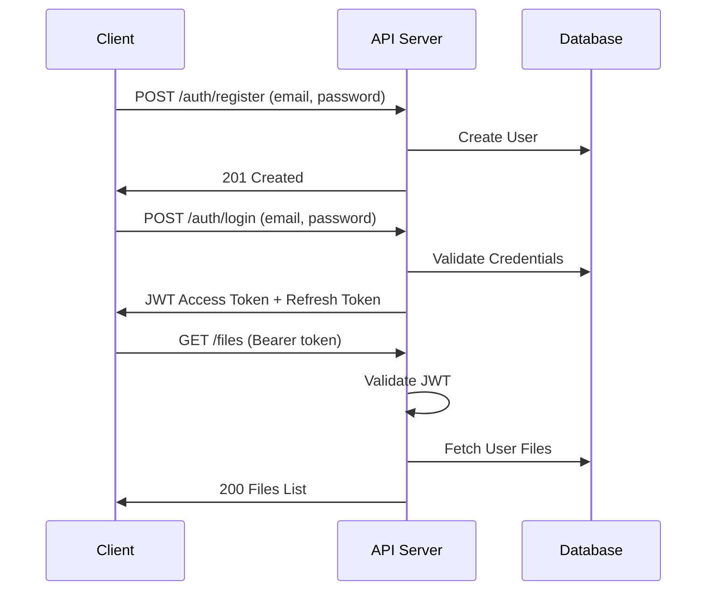
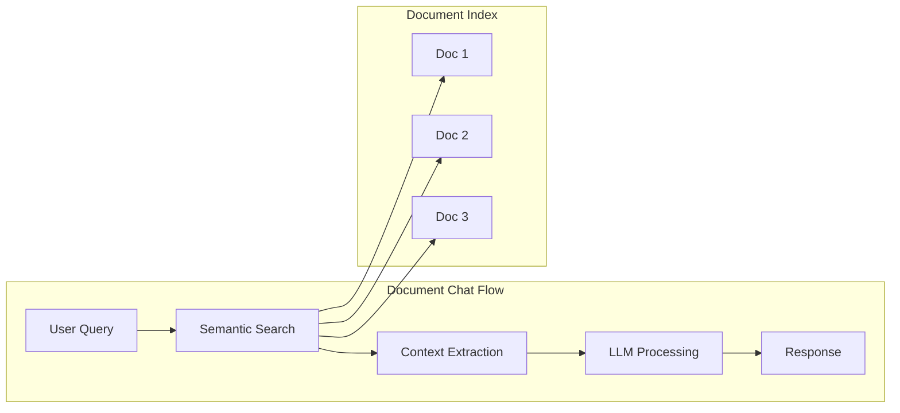
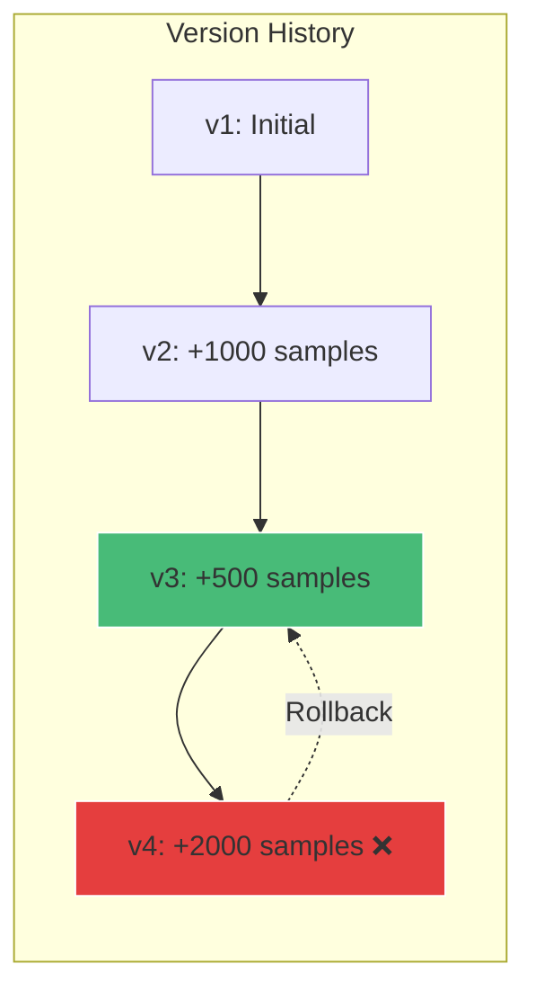
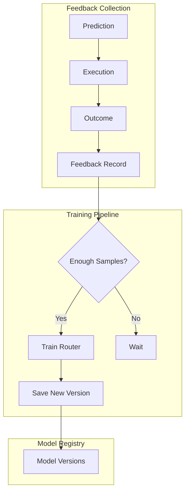

# 🏢 Enterprise Document Intelligence Platform

## Production-Ready Features for Document Management with ML

This document covers the enterprise-grade features that make this platform production-ready for real-world deployment.

---

## 🔐 Authentication & Authorization

### JWT-Based Authentication



### Role-Based Access Control (RBAC)

| Role | Permissions |
|------|------------|
| **viewer** | Read files, view stats |
| **user** | Upload, read, basic operations |
| **manager** | All user permissions + manage users, rollback models |
| **admin** | Full system access, delete, configure |

### API Endpoints

```
POST /api/v1/auth/register    - Create account
POST /api/v1/auth/login       - Get access token
POST /api/v1/auth/refresh     - Refresh token
GET  /api/v1/auth/me          - Get current user
POST /api/v1/auth/change-password - Change password
```

---

## 🏗️ Multi-Tenant Organizations

```python
# Organization model
class Organization:
    id: str
    name: str                    # "Acme Corp"
    slug: str                    # "acme-corp" (unique)
    plan: str                    # "free", "pro", "enterprise"
    storage_quota_gb: int        # 10, 100, 1000
    max_users: int               # 5, 50, unlimited
    settings: dict               # Custom settings
```

### Features by Plan

| Feature | Free | Pro | Enterprise |
|---------|------|-----|------------|
| Storage | 10 GB | 100 GB | Unlimited |
| Users | 5 | 50 | Unlimited |
| API Rate Limit | 100/min | 1000/min | Unlimited |
| Document Chat | ❌ | ✅ | ✅ |
| Model Rollback | ❌ | ✅ | ✅ |
| Custom Models | ❌ | ❌ | ✅ |

---

## 💬 MCP Document Chat

### Chat with Your Documents

The MCP (Model Context Protocol) server enables natural language interaction with uploaded documents.



### API Endpoints

```
POST /api/v1/mcp/chat         - Ask questions about documents
POST /api/v1/mcp/search       - Semantic search across documents
POST /api/v1/mcp/embed/{id}   - Generate embeddings for a document
GET  /api/v1/mcp/context/{id} - Get document context/summary
GET  /api/v1/mcp/similar/{id} - Find similar documents
```

### Example Usage

```bash
# Ask a question about your documents
curl -X POST /api/v1/mcp/chat \
  -H "Authorization: Bearer <token>" \
  -d '{
    "query": "What are the key findings from the Q4 report?",
    "max_context_docs": 5
  }'

# Response
{
  "answer": "The Q4 report highlights three key findings...",
  "sources": [
    {"file_id": "abc123", "filename": "Q4_report.pdf", "relevance": 0.95}
  ],
  "confidence": 0.87
}
```

---

## 🔄 Model Versioning & Rollback

### Version Management

Every model update is versioned, enabling:
- **Audit Trail**: Full history of all model changes
- **Comparison**: Compare metrics between versions
- **Rollback**: Instantly revert to previous versions
- **Integrity**: SHA-256 hash verification



### API Endpoints

```
GET  /api/v1/models/                    - List all tracked models
GET  /api/v1/models/{name}              - Get model status
GET  /api/v1/models/{name}/versions     - List all versions
GET  /api/v1/models/{name}/versions/{v} - Version details
GET  /api/v1/models/{name}/active       - Get active version
POST /api/v1/models/{name}/rollback     - Rollback to version
POST /api/v1/models/{name}/compare      - Compare two versions
```

### Example: Rollback

```bash
# Check current version
curl /api/v1/models/incremental_model/active

# Compare versions
curl -X POST /api/v1/models/incremental_model/compare \
  -d '{"version1": 3, "version2": 4}'

# Rollback to previous version
curl -X POST /api/v1/models/incremental_model/rollback \
  -H "Authorization: Bearer <admin_token>" \
  -d '{"version": 3}'
```

---

## 📊 Feedback & Continuous Learning

### Feedback Loop Architecture



### API Endpoints

```
POST /api/v1/feedback/predict       - Record a prediction
POST /api/v1/feedback/outcome/{id}  - Record actual outcome
POST /api/v1/feedback/complete      - Record full feedback
GET  /api/v1/feedback/readiness     - Check training readiness
POST /api/v1/feedback/train         - Trigger training
GET  /api/v1/feedback/history       - View feedback history
GET  /api/v1/feedback/stats         - Get statistics
```

### Continuous Improvement Cycle

1. **Record Prediction**: Before executing a strategy
2. **Record Outcome**: After execution with actual results
3. **Accumulate**: Collect 50+ samples
4. **Train**: Retrain router with feedback data
5. **Version**: Save new model version
6. **Validate**: Compare with previous accuracy
7. **Rollback**: If accuracy drops, rollback

---

## 🛡️ Input Validation & Security

### File Validation

```python
# Maximum file sizes by type
MAX_SIZES = {
    'document': 50 * 1024 * 1024,   # 50 MB
    'image': 10 * 1024 * 1024,       # 10 MB
    'data': 100 * 1024 * 1024,       # 100 MB
}

# Allowed MIME types
ALLOWED_TYPES = {
    'application/pdf',
    'image/jpeg', 'image/png',
    'text/csv', 'application/json',
    ...
}
```

### Path Traversal Prevention

```python
# Dangerous patterns blocked
BLOCKED = ['..', '~', '//', 'etc/passwd', 'windows/system32']
```

### SQL Injection Prevention

```python
# Blocked SQL keywords in user input
BLOCKED_SQL = ['SELECT', 'INSERT', 'UPDATE', 'DELETE', 'DROP', ...]
```

---

## 🐳 Docker Deployment

### Health Checks

```yaml
healthcheck:
  test: ["CMD", "curl", "-f", "http://localhost:5000/api/v1/health"]
  interval: 30s
  timeout: 10s
  retries: 3
  start_period: 40s
```

### Resource Limits

```yaml
deploy:
  resources:
    limits:
      cpus: '2'
      memory: 4G
    reservations:
      cpus: '0.5'
      memory: 512M
```

### Environment Variables

```bash
# Security
JWT_SECRET_KEY=your-secret-key
JWT_ALGORITHM=HS256
JWT_ACCESS_TOKEN_EXPIRE_MINUTES=30

# Database
MYSQL_HOST=mysql
MYSQL_DATABASE=filemanager

# Storage
MINIO_ENDPOINT=minio:9000
MINIO_ACCESS_KEY=minioadmin

# Model Storage
MODEL_BASE_DIR=/var/www/models
MAX_MODEL_VERSIONS=10
```

---

## 📈 API Summary

| Category | Endpoints | Auth Required | RBAC |
|----------|-----------|---------------|------|
| **Files** | CRUD operations | ✅ | user+ |
| **Auth** | Login, register, tokens | ❌/✅ | - |
| **Pipeline** | ML processing | ✅ | user+ |
| **Models** | Version management | ✅ | manager+ for rollback |
| **Feedback** | Learning data | ✅ | manager+ for train |
| **MCP Chat** | Document Q&A | ✅ | user+ |
| **Organizations** | Tenant management | ✅ | admin |

---

## 🚀 Quick Start

### 1. Start Services

```bash
docker-compose up -d
```

### 2. Register User

```bash
curl -X POST http://localhost:5000/api/v1/auth/register \
  -H "Content-Type: application/json" \
  -d '{"email": "user@example.com", "password": "SecurePass123!"}'
```

### 3. Login

```bash
curl -X POST http://localhost:5000/api/v1/auth/login \
  -H "Content-Type: application/json" \
  -d '{"email": "user@example.com", "password": "SecurePass123!"}'
```

### 4. Upload Document

```bash
curl -X POST http://localhost:5000/api/v1/files/upload \
  -H "Authorization: Bearer <token>" \
  -F "file=@document.pdf"
```

### 5. Chat with Document

```bash
curl -X POST http://localhost:5000/api/v1/mcp/chat \
  -H "Authorization: Bearer <token>" \
  -d '{"query": "Summarize this document"}'
```

---

## 📋 Database Migrations

Run migrations to set up all tables:

```bash
cd src
alembic upgrade head
```

Migration files:
- `6636fe22b643_tables.py` - Core tables
- `incremental_ml_pipeline.py` - ML pipeline tables
- `auth_and_organizations.py` - Auth & multi-tenant
- `feedback_persistence.py` - Feedback tables

---

## 🔍 Monitoring & Observability

### Health Endpoint

```bash
GET /api/v1/health

{
  "status": "healthy",
  "database": "connected",
  "minio": "connected",
  "models": {
    "router": "loaded",
    "incremental": "loaded"
  }
}
```

### Metrics

- Request latency (X-Process-Time header)
- Model version history
- Training accuracy trends
- Feedback statistics

---

## 🎓 Research Connection

This platform demonstrates how **database research concepts** enhance ML systems:

| Database Concept | Implementation |
|------------------|----------------|
| **IVM (Incremental View Maintenance)** | Incremental model updates |
| **Cost-Based Query Optimization** | Strategy cost estimation |
| **Learned Indexes** | ML-based routing |
| **MVCC (Multi-Version Concurrency)** | Model versioning |
| **Write-Ahead Logging** | Feedback persistence |
| **Materialized Views** | Document embeddings |

This makes the project highly relevant for the **DaST (Data Systems and Theory)** research group at UZH.
