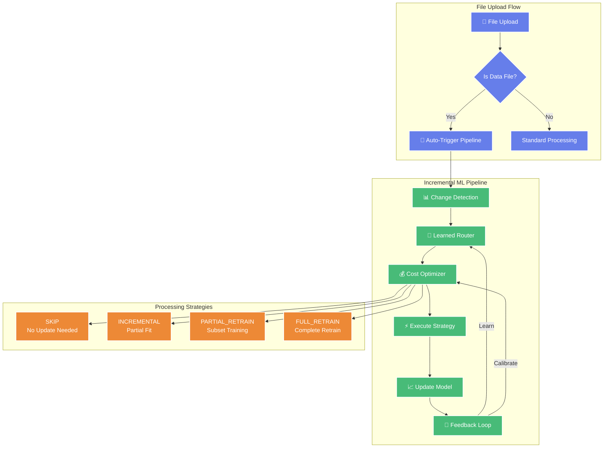
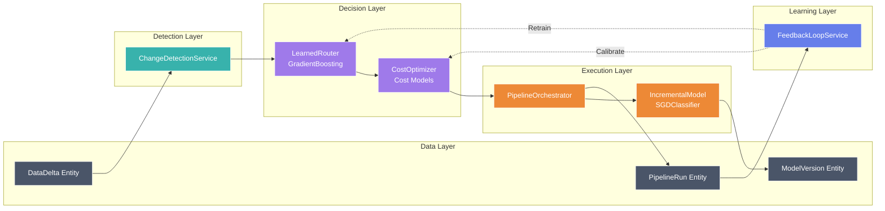
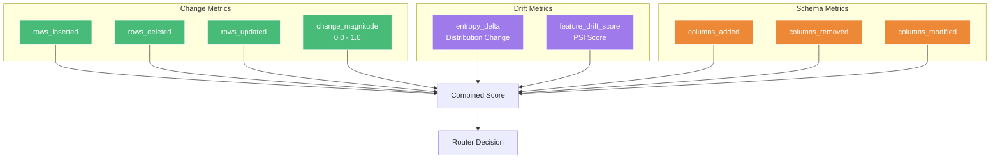
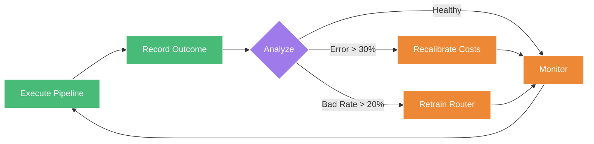

# 🧠 Incremental ML Pipeline

## Applying Database IVM Concepts to Machine Learning

This feature implements an intelligent **Incremental View Maintenance (IVM)** approach for machine learning model updates. Instead of retraining ML models from scratch on every data change, we apply database-inspired techniques to update models incrementally.

---

## 📊 Architecture Overview



---

## 🔬 Research Background

This implementation draws from cutting-edge database research:

| Concept | Database Origin | ML Application |
|---------|----------------|----------------|
| **Incremental View Maintenance (IVM)** | Updating materialized views incrementally | Update ML models with only changed data |
| **Cost-Based Optimization** | Query optimizer cost models | Estimate processing cost for each strategy |
| **Learned Indexes** | ML-enhanced database indexes | ML-based routing decisions |
| **Adaptive Query Processing** | Runtime query plan adjustment | Dynamic strategy selection |

### Key Innovation

> **Instead of treating ML model updates as monolithic operations, we decompose them into incremental operations similar to how databases handle view maintenance.**

---

## 🏗️ Component Architecture



---

## 📁 File Structure

```
src/
├── entities/
│   └── data_delta.py          # DataDelta, ModelVersion, PipelineRun entities
├── infrastructure/
│   ├── learned_router.py      # ML-based routing decisions
│   ├── cost_optimizer.py      # Cost estimation and optimization
│   └── incremental_model.py   # Incremental ML model implementation
├── services/
│   ├── change_detection_service.py  # Delta detection
│   ├── pipeline_orchestrator.py     # Pipeline coordination
│   └── feedback_loop_service.py     # Continuous improvement
├── repositories/
│   └── delta_repository.py    # Data access for deltas
└── api/routes/
    └── pipeline.py            # REST API endpoints
```

---

## 🔄 Processing Strategies

### 1. **SKIP** - No Update Needed
- **When**: Change magnitude < 1%, drift < 5%
- **Action**: Validate on new data, no model update
- **Cost**: ~0 seconds
- **Use Case**: Tiny corrections, metadata updates

### 2. **INCREMENTAL** - Partial Fit
- **When**: Change magnitude 1-15%, low drift
- **Action**: `partial_fit()` on new/changed rows only
- **Cost**: ~1-5 seconds
- **Use Case**: New data appended, minor updates

### 3. **PARTIAL_RETRAIN** - Subset Training
- **When**: Change magnitude 15-40%, moderate drift
- **Action**: Retrain on affected subset + sample
- **Cost**: ~10-30 seconds
- **Use Case**: Significant batch updates

### 4. **FULL_RETRAIN** - Complete Retraining
- **When**: Change > 40%, schema change, high drift
- **Action**: Full model retraining from scratch
- **Cost**: ~30-120 seconds
- **Use Case**: Major data changes, schema evolution

---

## 📈 Delta Detection Metrics



---

## 🧠 Learned Router

The router uses a **GradientBoostingClassifier** trained on 13 features:

| Feature | Description |
|---------|-------------|
| `insert_ratio` | Fraction of new rows |
| `delete_ratio` | Fraction of deleted rows |
| `update_ratio` | Fraction of updated rows |
| `change_magnitude` | Overall change score (0-1) |
| `entropy_delta` | Change in data distribution |
| `feature_drift_score` | PSI-based drift detection |
| `columns_added_count` | Number of new columns |
| `columns_removed_count` | Number of removed columns |
| `columns_modified_count` | Number of modified columns |
| `is_schema_change` | Binary schema change flag |
| `rows_before_log` | Log-scaled row count before |
| `rows_after_log` | Log-scaled row count after |
| `time_since_last_update` | Hours since last update |

### Training Process

```python
# Bootstrap with synthetic data
POST /api/v1/pipeline/router/train-synthetic?n_samples=500

# Or train on historical outcomes
POST /api/v1/pipeline/router/train
```

---

## 💰 Cost Optimizer

The cost optimizer uses calibrated models to estimate:

- **Time**: `base + per_row * rows + per_change * changes`
- **Memory**: `base + per_row * rows`
- **Cost**: `(CPU hours × rate) + (Memory GB hours × rate)`

### Calibration

```python
# Run benchmark to calibrate coefficients
POST /api/v1/pipeline/cost/calibrate

# View current coefficients
GET /api/v1/pipeline/cost/stats
```

---

## 🔄 Feedback Loop

The system continuously improves through:

1. **Outcome Recording**: Every pipeline execution records actual vs estimated metrics
2. **Auto-Calibration**: Triggers when estimation error > 30%
3. **Auto-Retraining**: Triggers when bad decision rate > 20%
4. **Recommendations**: Provides actionable improvement suggestions



---

## 🚀 API Reference

### Pipeline Endpoints

| Method | Endpoint | Description |
|--------|----------|-------------|
| `POST` | `/pipeline/detect-changes/{file_id}` | Detect changes in a file |
| `POST` | `/pipeline/route` | Get routing decision for delta |
| `POST` | `/pipeline/optimize` | Get optimized strategy |
| `POST` | `/pipeline/execute` | Execute pipeline for delta |
| `POST` | `/pipeline/run/{file_id}` | Run full pipeline for file |

### Router Endpoints

| Method | Endpoint | Description |
|--------|----------|-------------|
| `POST` | `/pipeline/router/train-synthetic` | Train router with synthetic data |
| `POST` | `/pipeline/router/train` | Train router with historical data |
| `GET` | `/pipeline/router/status` | Get router training status |

### Cost Endpoints

| Method | Endpoint | Description |
|--------|----------|-------------|
| `POST` | `/pipeline/cost/calibrate` | Run calibration benchmark |
| `GET` | `/pipeline/cost/stats` | Get calibration statistics |
| `POST` | `/pipeline/estimate-cost` | Estimate cost for strategy |

### Monitoring Endpoints

| Method | Endpoint | Description |
|--------|----------|-------------|
| `GET` | `/pipeline/health` | Comprehensive health check |
| `GET` | `/pipeline/model/status` | ML model training status |
| `GET` | `/pipeline/model/timing-stats` | Execution timing statistics |
| `GET` | `/pipeline/feedback/stats` | Feedback loop statistics |
| `GET` | `/pipeline/feedback/recommendations` | Improvement recommendations |
| `GET` | `/pipeline/analytics/drift-summary` | Drift summary analytics |
| `GET` | `/pipeline/analytics/cost-savings` | Cost savings analytics |

---

## 🛠️ Installation & Setup

### 1. Build and Start Services

```bash
docker-compose build
docker-compose up -d
```

### 2. Run Database Migrations

```bash
docker-compose exec filemanager bash
alembic upgrade head
```

### 3. Bootstrap the Router

```bash
# Train the learned router with synthetic data
curl -k -X POST "https://localhost:9443/api/v1/pipeline/router/train-synthetic?n_samples=500"
```

### 4. Calibrate Cost Models

```bash
# Run calibration benchmark
curl -k -X POST "https://localhost:9443/api/v1/pipeline/cost/calibrate"
```

### 5. Verify Health

```bash
# Check all components
curl -k "https://localhost:9443/api/v1/pipeline/health"
```

Expected response:
```json
{
  "data": {
    "status": "healthy",
    "components": {
      "router": {"status": "healthy", "mode": "ml", "is_trained": true},
      "cost_optimizer": {"status": "healthy", "has_calibration_data": true},
      "ml_model": {"status": "healthy", "is_trained": true},
      "database": {"status": "healthy"}
    }
  }
}
```

---

## 📊 Example Usage

### Upload a CSV File

The pipeline automatically triggers when CSV/data files are uploaded:

```bash
# Initialize upload
curl -k -X POST "https://localhost:9443/api/v1/file/upload/init/"

# Upload chunk
curl -k -X POST "https://localhost:9443/api/v1/file/upload/chunk/" \
  -F "chunk_size=1000" \
  -F "upload_id=<upload_id>" \
  -F "chunk_index=0" \
  -F "file=@data.csv"

# Complete upload (triggers pipeline automatically)
curl -k -X POST "https://localhost:9443/api/v1/file/upload/complete/" \
  -F "upload_id=<upload_id>" \
  -F "total_chunks=1" \
  -F "total_size=1000" \
  -F "file_extension=csv" \
  -F "content_type=text/csv" \
  -F "appointment_id=test" \
  -F "user_id=user1" \
  -F "filename=data.csv"
```

### Manually Run Pipeline

```bash
curl -k -X POST "https://localhost:9443/api/v1/pipeline/run/<file_id>?target_column=label&priority=balanced"
```

### Check Recommendations

```bash
curl -k "https://localhost:9443/api/v1/pipeline/feedback/recommendations"
```

---

## 🔬 Research Relevance

This implementation is relevant to several active research areas:

### 1. **Incremental View Maintenance (IVM)**
- Applies classical IVM concepts to ML model updates
- Demonstrates delta-based computation for non-relational workloads

### 2. **Learned Query Optimization**
- Uses ML to make processing decisions (learned router)
- Adapts to workload patterns through feedback

### 3. **Cost-Based Optimization**
- Implements calibrated cost models for ML operations
- Multi-objective optimization (time, memory, accuracy)

### 4. **Self-Tuning Systems**
- Automatic calibration through feedback loop
- Continuous improvement without manual intervention

### 5. **Data-Centric AI**
- Focuses on data quality and change management
- Tracks data evolution through versioning

---

## 📚 References

- [Incremental View Maintenance](https://en.wikipedia.org/wiki/Incremental_view_maintenance) - Database concept
- [Learned Index Structures](https://arxiv.org/abs/1712.01208) - ML for database indexes
- [Cost-Based Query Optimization](https://www.microsoft.com/en-us/research/publication/an-overview-of-query-optimization-in-relational-systems/) - Query optimizer design
- [Online Learning](https://scikit-learn.org/stable/modules/sgd.html) - SGD for incremental learning

---

## 👨‍💻 Contributing

To contribute to the incremental ML pipeline:

1. Fork the repository
2. Create a feature branch from `incremental-ml-pipeline`
3. Implement your changes
4. Add tests in `src/tests/`
5. Submit a pull request

---

## 📄 License

This project is open source under the MIT License.
